# Holos Research v2.1 - Human-Centered Auto-Research 状态机设计

> Version: Draft v2.1 - 2026-05-11  
> Status: 设计阶段，未落地  
> Replaces: Draft v2  
> 前置文档: [DESIGN.md](./DESIGN.md) (v1) · [ARCHITECTURE.md](./ARCHITECTURE.md) (v1 实现) · [ANALYSIS.md](./ANALYSIS.md) (v1 病灶) · [design-board.pdf](./design-board.pdf) (v2 board)

---

## 0. 摘要

v2 把 v1 的 "9 阶段单链状态机" 改成 "两层状态机 + Result Quality Gate + Skill Library + Tournament Pool"。这个方向正确，尤其解决了两个硬问题：

1. `spec` 阶段把算法设计与代码实现揉在一起，导致 method proposal 像玩具工程方案，而不是可发表的研究机制。
2. `experiment` 阶段缺少结果质量闸门和分级诊断，agent 容易在失败时过早放弃，或在弱结果下急着进入 paper/claim 写作。

但 v2 仍然漏掉了一个更根本的科研问题：**research 不是只靠 novelty / feasibility / metric gate 推进的，它还需要 paper story、贡献定位和人的 taste。**

本 v2.1 做四类修改：

1. **把 Story / Positioning 提升为一等状态。**  
   Idea 阶段不只产出可行 idea，还必须产出 `StorySpine`：field assumption、pain point、non-obvious insight、why now、what changes if true、candidate paper angle。Ground 阶段不再主要负责 "否定 idea"，而是负责把 idea 定位成最适合的 paper story。

2. **把自动选择降级为推荐，把人类 taste 作为明确 checkpoint。**  
   Tournament / ranking 只能推荐 top-K，不能自动替用户做 selected/final 决策。系统以人为中心：agent 做搜索、对比、诊断、压缩信息；用户保留方向、taste、叙事和投入资源的最终控制权。

3. **把 v2 的工程机制收紧为更可落地的 phase-run 设计。**  
   `state.focus` 只保存项目当前关注点，不承载完整 inner loop。每次 phase 执行记录为 `.research/phase_runs/run_XXX.yaml`，包含 attempt/evaluate/decide、budget、checkpoint、pivot reason、human checkpoint。这样能支持长期项目、回退、恢复和审计，而不会把 `state.yaml` 变成不可维护的大对象。

4. **把研究过程本身作为 append-only 资产保存。**  
   研究过程中产生的 idea、设计取舍、失败实验、用户反馈、阶段转换、agent 诊断和关键上下文，都自动写入 research timeline / journal。这个记录功能应该尽量无感：agent 和人类正常做研究动作时，系统自动追加结构化事件和简短研究笔记；关键阶段再生成 snapshot，供回顾、恢复、复盘和未来训练 AutoResearch agent 使用。

v2.1 外层收敛为 6 个核心 research phase：

```text
explore -> ground -> design -> realize -> experiment -> compose
```

其中 v1 的 `spec` 被拆成：

- `design`: 算法/机制/贡献设计，不写工程实现。
- `realize`: 把通过设计审查的 method spec 落成可运行、可测试、可复现的代码 artifact。

`claim`、`audit`、`submit_review`、`archive` 不再作为默认外层 phase，而是下沉为 `compose` 及后续 paper/submission 对象的内部工作流。这样主状态机更短，agent 更不容易为了“进入下一阶段”而提前凑 claim；真正需要的过度主张检查、审计、投稿和归档仍保留为对象级 gate 和工具流程。

v2.1 的核心判断标准：

> 系统不应该把一个 idea 过早打死，也不应该把一个弱结果包装成 paper。它应该持续帮助人类研究者找到：这个方向是否值得继续、应该讲成什么故事、当前失败是代码问题/实验问题/方法问题/叙事问题中的哪一种。

---

## 1. 从第一性原理重新定义目标

### 1.1 Auto-research 不是自动发论文

Holos Research 的目标不是 "把一句 idea 自动变成论文"。现实科研不是线性流水线，而是反复经历：

- 方向看似有趣，但缺少可讲的核心 story。
- idea 没有被完全否定，但需要换贡献类型。
- 方法机制有想法，但实现代码像 toy。
- 实验失败，不知道是 bug、超参、数据、benchmark 还是方法本身。
- 结果有正信号，但不足以支撑强 claim。
- paper 写出来后，发现真正的贡献边界要重新收缩。

因此系统的任务是：

1. **加速搜索。** 帮人类更快看更多论文、更多 idea、更多失败模式。
2. **结构化判断。** 把 "感觉不行" 拆成 novelty、story、mechanism、evidence、implementation、risk。
3. **保留路径。** 失败的、被搁置的、被收缩的对象都要可回看。
4. **降低主 agent 负担。** 主 agent 不应该凭直觉从 10 个 idea 里手动筛 3 个；它应该组织 subagent 和工具完成 ranking、positioning、diagnosis，然后让用户做 taste 决策。
5. **防止坏自动化。** 不能让 agent 因为想完成流程而凑 claim，也不能让 critic 因为严格而把所有早期 idea 打成 "nothing"。

### 1.2 核心理念

#### 理念一：Human-Centered Research Acceleration

高质量学术论文的产出，本质上是一个受限于研究者时间的 craftsman 过程。一个有研究品味的人要做出真正有价值的方向，通常需要调研大量文献、跑多轮实验、反复修改方法和 claim、经历写作和审稿循环。系统要加速的是这些执行性、组织性、记忆性工作，而不是替代研究者的 taste。

**"人" 在系统里体现为明确控制点：**

- 人定义和更新 `anchor`：研究到底想解决什么问题。
- 人选择值得 ground 的 idea：agent 排名和解释，用户做 taste selection。
- 人确认 paper positioning：这个 idea 是否有值得讲的 story。
- 人决定是否投入实现和算力：尤其在 `design -> realize`、大规模实验前。
- 人确认 paper ambition：结果到底该强讲、弱讲、收缩，还是继续补实验。
- 人确认 pivot：遇到失败时，是修代码、改实验、重想方法、重定位 story，还是换方向。

因此 Holos Research 的目标不是超过研究者本人，而是让系统在足够多执行性工作上接近一个可靠研究助理，使最终产出尽可能接近研究者本人在充足时间下能完成的论文质量。

#### 理念二：过程即资产

一篇 paper 的产出不是终点。数月级研究过程中会产生大量高价值过程数据：

- 被推翻的 idea 和原因。
- 实验失败记录和根因分析。
- 人类在每个阶段的反馈和决策理由。
- 每个 phase 转换时的完整上下文。
- agent 的诊断、review、routing、错误和修复。
- 不同 story / claim / method 版本的演化轨迹。

这些不是临时日志，而是研究资产。v2.1 要完整保存研究过程的数字化痕迹：结构化 timeline、append-only research journal、phase snapshots、关键对话引用、artifact hash、human checkpoint 和 decision rationale。它们同时服务于当前项目回顾、未来项目迁移、团队 handoff，以及下一代 AutoResearch agent 的训练数据。

#### 理念三：AutoResearch 本身也要进化

研究 pipeline 不应是静态 prompt 集合。系统运行足够多项目后，会积累跨项目反馈信号：

- 哪些 idea 类型总在 ground 阶段被 scooped。
- 哪些 design rubric 分数能预测 experiment 成功。
- 哪些 realize sanity gate 最能减少实验假阴性。
- 哪些 paper/claim ambition 最容易在 compose gate 或 reviewer 阶段被打回。
- 哪些 human feedback 反复指出 agent taste 的盲区。

这些信号应该反过来驱动 AutoResearch 流程演化：调整 idea generation 策略、重权重 rubrics、改写 skills、A/B test 不同 grounding 方法、识别低效 phase route。换句话说，Holos Research 不只管理一个 research project，也把 research pipeline 本身当成可实验、可评估、可优化的对象。

### 1.3 v1 两周测试暴露的挑战

| 挑战 | 具体表现 | v2.1 设计回应 |
|---|---|---|
| Agent 难以提出真正有价值的 idea | idea 过细、缺少惊讶感；算法设计尚可，但问题定义和洞察提炼薄弱 | `explore` 引入 StorySpine、wonder-driven ideation、story rubric；`ground` 强制做 contribution reframe |
| 实验代码不 solid | 在 toy data 上自证；benchmark 不真实；数据泄露、metric 不一致、参数设置不合理 | `realize` 独立成 phase；CodeArtifact、baseline reproduction、eval golden fixture、quality gates、evidence-grade experiment requirement |
| Agent 的信念动摇 | 结果不好就轻易放弃；或者把 strong claim 降成 weak claim 来凑 paper | `experiment` 强制 DiagnosisReport L1-L6；method-failure pivot 前必须排除代码/数据/eval/seed/benchmark 问题；paper ambition 由 human checkpoint 确认 |
| 研究进程漂移 | agent 长时间修 bug 后忘记整体目标；skill 约束被逐渐忽略；Research Wiki 记录了但后续不用 | 复用 phase_run 的 `context_refresh`：关键动作前刷新 anchor/refs/snapshot/wiki/checklist，并记录 used_wiki_refs 与 drift_check |

### 1.4 四个用户反馈对应的系统病灶

| 用户反馈 | 第一性原理诊断 | v2.1 修复 |
|---|---|---|
| idea 阶段调研全面，但缺故事感/价值感 | idea 格式缺少 "why this matters as a paper" 的结构字段 | 新增 `StorySpine` 与 story rubric，explore 阶段就写 paper angle |
| ground 阶段过严，把好 idea 打压没了 | ground 被设计成 novelty court，而不是 contribution positioning | ground 改成 "reframe before reject"，每个候选都给 paper positioning |
| method-spec 最差，算法与代码揉在一起，玩具感重 | 机制设计、实验设计、实现设计混层 | 拆成 `design` 和 `realize`，并给 realize 加代码质量门 |
| experiment 容易放弃或急着 claim | 失败诊断无层级，结果质量无硬 gate | 5 级 debug + RQG + DiagnosisReport + human pivot checkpoint |

### 1.5 理念/挑战到设计动作的追踪矩阵

本节是 v2.1 的设计 traceability。后续每个 schema、tool、skill、phase 改动都应该能回答：它服务哪条理念，或者修复哪个 v1 挑战。不能映射到理念或挑战的机制，默认不进入核心路径。

#### 核心理念如何落到系统设计

| 理念 | 设计动作 | 落点 | 解决什么问题 |
|---|---|---|---|
| Human-Centered Research Acceleration | 自动 ranking 只给推荐，不自动替人 selected/final；关键 taste 节点加 human checkpoint | §2 P1, §5.3, §7.3, §8.2, §13 | 保留研究者对方向、story、paper ambition、资源投入和 pivot 的最终判断 |
| Human-Centered Research Acceleration | `anchor` 作为长期研究意图；phase promote/pivot 时记录 human decision rationale | §3.1, §3.3, §3.4, §15.1 | 让系统始终围绕人的研究目标加速，而不是自己漂移到容易完成的任务 |
| Human-Centered Research Acceleration | `explore` 负责 dream ideas，`ground` 负责 verify and position；不把早期 idea 过早判死 | §4.3, §7, §8 | 人负责 taste，agent 负责扩大搜索空间并把备选方向讲清楚 |
| 过程即资产 | 所有关键动作自动追加 timeline event 与 journal note | §2 P9, §3.3, §15.1 | 把研究历程、失败原因、人类反馈、阶段转换上下文变成可回顾资产 |
| 过程即资产 | phase promote/pivot/block、human checkpoint、RQG 状态变化生成 snapshots | §3.4, §15.2, §18 | 长期项目可恢复、可审计；上下文压缩后不依赖模型记忆 |
| 过程即资产 | artifact hash、experiment refs、paper-visible result refs 强制记录 | §3.4, §10, §11, §13, §17 | 让论文中的每个结果都能回到实验、代码、环境和证据来源 |
| AutoResearch 本身的进化 | 记录 phase 成败、pivot reason、rubric score、human override、reviewer demand | §2 P10, §3.3, §18 P2, §21 | 让 pipeline 可以通过跨项目统计和 A/B test 自我改进 |
| AutoResearch 本身的进化 | rubrics 从 phase config 获取，而不是散落在 prompt 中 | §16 | 让评分维度可版本化、可比较、可实验，而不是隐含在 skill 文本里 |

#### v1 挑战如何落到系统设计

| v1 挑战 | 设计动作 | 落点 | 为什么这样能修复 |
|---|---|---|---|
| Agent 难以提出真正有价值的 idea | `explore` 使用 wonder-driven ideation、相邻领域迁移、failure map；每个 top-K idea 必须有 StorySpine | §6.1, §7.1, §7.2 | 强迫 idea 不只是技术 tweak，而要说明 field assumption、pain point、non-obvious insight 和 what changes if true |
| Agent 难以提出真正有价值的 idea | `ground` 对每个候选至少尝试 2 种 contribution reframe，不直接 reject | §8.2, §8.3 | 很多早期 idea 的问题不是没价值，而是 contribution type 讲错了；先重定位再淘汰 |
| 实验代码不 solid | `realize` 独立成 phase，输出 CodeArtifact；要求 baseline reproduction、eval golden fixture、sanity/quality gates | §10.1, §10.2, §10.4 | 把 "代码能跑" 提升为 "代码能产出可信证据"，减少 toy data 自证和假阴性 |
| 实验代码不 solid | Realize 同时注册 ExperimentMatrix；experiment phase 只执行和诊断已注册实验 | §10.3, §11.1 | 防止实验阶段临时发明不一致实验，确保 main/baseline/ablation/seed 与设计标准对齐 |
| 实验代码不 solid | Compute Submit Kit 统一提交、日志、metrics、artifact、environment | §11.2 | 不再每个 backend 临时拼命令，降低环境漂移、结果丢失和不可复现 |
| Agent 的信念动摇 | method-failure pivot 前必须完成 DiagnosisReport L1-L6 | §11.3, §11.4, §11.7 | 先排除训练、eval、数据、超参、seed、benchmark/story mismatch，再判断方法失败 |
| Agent 的信念动摇 | RQG 区分 `passed/partial/failed/invalid`，并给 allowed/disallowed next | §11.5, §11.6 | 防止 agent 把弱结果包装成强 claim，也防止遇到 partial signal 就放弃 |
| Agent 的信念动摇 | `compose` 阶段内确认 paper/claim ambition，strong claim 必须 RQG-backed | §13 | 降 claim 不是 agent 逃避失败的默认动作，而是证据边界内的人类确认 |
| 研究进程漂移 | `state.yaml` 只存全局指针和配置，phase_run 存执行状态和 refs，snapshot 存阶段上下文 | §3.1, §3.2, §3.4 | 长时间修 bug 后能从 active phase run 和 snapshot 找回整体进程，同时避免 refs 双写 |
| 研究进程漂移 | Context Refresh：phase entry、长任务恢复、promote/pivot 前更新 `phase_run.context_refresh` | §3.5, §5, §15 | 不是只把信息存下来，而是强制 agent 在继续工作前重新加载 anchor、active refs、last decisions、constraints |
| 研究进程漂移 | Skill checklist：复用 skill 文本中的 must/forbidden/checkpoint 规则，并记录到 `checked_skill_rules` | §3.5, §5, §15 | 防止长时间运行后 skill 规范逐渐失效，不新增独立 contract 系统 |
| 研究进程漂移 | Wiki reuse：ground/design/compose 前必须查询并在 `used_wiki_refs` 中记录实际使用的 wiki refs | §3.5, §6, §8, §9, §13 | Research Wiki 不再只是记录，而是作为 phase 输入被复用 |
| 研究进程漂移 | Drift check：长任务后在 `context_refresh.drift_check` 中记录当前动作是否仍对齐 anchor、PaperPath、phase goal | §3.5, §11 | 发现局部任务吞噬全局目标时，block 或要求重新确认 next action |

---

## 2. v2.1 设计原则

### P1. Human taste is a control point, not a missing variable

Agent 可以排序、解释、压缩、模拟 reviewer，但不能自动替用户选择研究 taste。以下节点默认有人类 checkpoint：

- `explore -> ground`: 选择要深入的候选方向。
- `ground -> design`: 确认 paper positioning 是否有味道。
- `design -> realize`: 确认机制值得投入实现。
- `realize -> experiment`: 确认代码 artifact 值得投入真实实验资源。
- `experiment -> compose`: 确认结果质量和 paper/claim ambition。
- 所有 outer pivot：确认是修代码、改实验、收缩 paper story，还是换方向。

在 `autonomous` mode 下，agent 可以先给推荐决策，但仍必须把 taste-sensitive 决策写成 explicit checkpoint event，便于用户之后审计或回滚。

### P2. Story is state

Story 不能只在 compose 阶段才出现。一个 idea 从 explore 开始就应该携带：

- 它挑战了哪个 field assumption。
- 它解决了谁的具体痛点。
- 它的 non-obvious insight 是什么。
- 如果它成立，研究者或实践者会改变什么。
- 它适合讲成 new method、new problem、new analysis、empirical finding 还是 benchmark paper。

这些信息不是 "写作润色"，而是早期研究决策的一部分。

### P3. Grounding should reframe before reject

Ground 阶段的默认动作不是 kill，而是定位：

1. 找 closest work。
2. 识别 idea 与 closest work 的真实差异。
3. 判断原贡献类型是否错误。
4. 尝试至少 2 种 reframe。
5. 只有在 core claim 被完全 scooped、无可收缩贡献、或 anchor drift 严重时才 reject。

### P4. Design and realization are different cognitive tasks

`design` 回答：

> 为什么这个机制可能 work？它和已有方法在机制层面有什么不同？什么实验能证伪它？

`realize` 回答：

> 这个机制是否被正确、可复现、可扩展地实现？代码能否支撑真实实验？

两个问题必须分 phase、分 rubric、分 reviewer。

### P5. Result quality is not experiment completion

实验 "跑完" 不是 evidence。进入 compose 至少要求：

- 结果满足 plan 中结构化 `kill_set`。
- 结果满足足够支撑 paper 主叙事的 `sufficient_set`。
- effect size / significance / absolute delta 达到阈值。
- metric 可重算，artifact 存在且 hash 记录。
- negative / weak results 被明确反映到 claim strength，而不是被忽略。

### P6. Diagnose before pivot

任何 `experiment -> realize/design/ground` 的 pivot 前，必须先产出 `DiagnosisReport`：

- Training health 是否正常？
- Eval correctness 是否正常？
- Data integrity 是否正常？
- Hyperparameter range 是否合理？
- Seed stability 是否足够？
- Benchmark / metric 是否与 claim 对齐？
- 失败更像 implementation、experiment design、method mechanism、story framing 还是 scope 选择？

没有 DiagnosisReport 的 rollback 是不合法的。

### P7. Automation should reduce main-agent burden

主 agent 的职责是 orchestrate，不是独自凭感觉做所有判断。v2.1 明确：

- idea ranking 由 subagents + rubric + pool 完成。
- ground 每个候选由不同 subagent 做 closest-work 和 reframe。
- design critic 只评价机制，不评价 Docker 和训练脚本。
- realize inspector 只评价代码和可复现性，不评价贡献新颖性。
- experiment diagnosis 优先由自动报告和轻量 inspector 完成。

### P8. State should be resumable and inspectable

项目级 `state.yaml` 保持轻量，只回答 "现在在哪里"。每次 phase 执行写入 `phase_runs/`，保存完整 inner-loop 状态。timeline / journal 负责记录研究历程和审计线索，但不承担恢复当前 phase 的完整运行状态。

### P9. Research notes should be append-only and ambient

研究笔记不应该依赖 agent "想起来再记"。凡是产生 idea、修改 StorySpine、确认 PaperPath、提交 design、注册实验、完成诊断、改变 claim、阶段转换、用户给出反馈，都应该自动追加 timeline event 和 research journal note。这个过程对用户和 agent 都应尽量无感：做动作本身就产生记录，避免长期项目在上下文压缩后丢失关键判断。

### P10. The pipeline is itself an experimental object

每个 phase 的成功率、失败原因、pivot 类型、human checkpoint 反馈、review score 分布，都应被记录成可聚合信号。AutoResearch pipeline 不应固定不变；它应该能根据跨项目统计和 A/B test 结果演化，例如调整 idea generation prompt、改变 ground rubric 权重、提高某类 sanity gate 的优先级，或者发现某个 phase 的设计本身有问题。

### P11. Context must be refreshed, not just stored

解决研究进程漂移不需要再发明一套独立上下文系统。v2.1 复用已有 `state.yaml -> active_phase_run -> snapshot/timeline/wiki` 链路：每次 phase entry、resume、长任务后、promote/pivot 前，agent 必须刷新当前 phase context，并把刷新结果写回 `phase_run.context_refresh`。

这个机制只做三件事：

1. 重新读取当前 `anchor`、`phase_run.refs`、最近 snapshot 和关键 journal notes。
2. 重新读取当前 phase 必需的 StorySpine / PaperPath / Plan / DiagnosisReport / Wiki refs。
3. 检查当前 skill 的简短 checklist：哪些事情必须做，哪些动作当前禁止做。

这样保留“强制重新使用上下文”的效果，但避免新增 `context/` 目录、独立 rehydration packet、独立 drift audit 工具和额外状态机。

---

## 3. 文件结构

v2.1 保留 v1 的 `.research/` 基本布局，新增过程记忆、snapshot 和执行状态目录：

```text
.research/
  state.yaml
  timeline.jsonl                       # append-only structured event stream

  journal/                             # 新增：append-only 研究笔记与人类决策理由
    research_notes.jsonl
    human_decisions.jsonl
    conversation_refs.jsonl            # 可选：关键原始对话片段/引用/摘要

  phase_runs/                         # 新增：每次 phase 执行的 inner-loop 状态
    run_1746812345678_a3f9.yaml
    run_1746812345678_a3f9.checkpoint.001.yaml
    run_1746812400000_b7e2.yaml

  snapshots/                           # 新增：阶段转换和关键决策的可持久化快照
    snap_2026-05-09T100000Z/
      manifest.yaml
      state.yaml
      phase_run.yaml
      refs.yaml
      artifact_hashes.json

  positioning/                        # 新增：story spine 与 paper angle
    idea_001.story.yaml
    idea_001.grounding.yaml
    paper_path_001.yaml

  tournaments/                        # 新增：ranking pool，不自动替代用户选择
    idea_pool.yaml

  code_artifacts/                      # 新增：通过 sanity 的实现 artifact
    artifact_001/
      spec.yaml
      smoke_test.log
      code_ref.txt

  rqg/                                # 新增：Result Quality Gate 报告
    plan_001.rqg.latest.yaml
    exp_batch_003.rqg.yaml

  ideas/
  plans/
  experiments/
  claims/                              # 可选对象：compose 内部使用，不再是外层 phase
  exhibits/
  manuscripts/
  submissions/
  literature/
```

### 3.1 state.yaml 的职责

`state.yaml` 只保存项目级当前快照和全局指针。它不保存当前 phase 的对象 refs；refs 属于 active `phase_run`。这样避免 `state.focus.refs` 与 `phase_run.refs` 双写后不一致。

```yaml
project: "..."
anchor: "..."
config:
  participation_mode: collaborative
  venue: "ICLR"
counters:
  idea: 12
  plan: 2
  exp: 18
focus:
  phase: experiment
  since: "2026-05-09T10:00:00Z"
  active_phase_run: run_1746812400000_b7e2
  next: "Run L2 eval correctness diagnosis before deciding pivot"
```

不要把 refs、完整 inner loop、review history、debug traces 塞进 `focus`。读取当前工作对象时，先从 `state.focus.active_phase_run` 找到 phase run，再读 `phase_run.refs`。

读取规则：

```text
current phase = state.focus.phase
current run   = phase_runs[state.focus.active_phase_run]  # e.g. phase_runs/run_1746812400000_b7e2.yaml
current refs  = current run.refs
```

如果 `state.focus.active_phase_run` 缺失，说明是 legacy project 或尚未进入 phase run；工具应创建一个 run，并把当前上下文 refs 写入 run，而不是回填到 state。

### 3.2 phase_runs 的职责

每次进入一个 phase 创建一个 phase run：

```yaml
id: run_1746812400000_b7e2
phase: experiment
status: active                 # active | promoted | pivoted | aborted | blocked
created: "2026-05-09T10:00:00Z"
updated: "2026-05-09T12:00:00Z"

inner_loop:
  state: attempt               # attempt | evaluate | decide | blocked | promoted | pivoted | aborted
  round: 3
  attempts: 3
  stagnation_rounds: 1
  last_decision: iterate       # iterate | pivot | promote | abort
  budget:
    max_attempts: 10
    max_stagnation: 3
    max_escalations: 2

refs:
  idea: idea_003
  plan: plan_002
  experiments: [exp_010, exp_011]

human_checkpoints:
  - kind: pivot_confirmation
    status: pending
    question: "Results failed RQG after L1-L5 passed. Pivot to design or narrow claim?"

artifacts:
  last_attempt_ref: exp_batch_003
  last_evaluation_ref: rqg/exp_batch_003.rqg.yaml
  diagnosis_report: experiments/exp_batch_003.diagnosis.yaml
```

### 3.3 research timeline 与 append-only journal

v2.1 区分两层 append-only 记录。两者都只追加，不改写，但职责不同：

- `timeline.jsonl`: **事实事件流**。记录 "发生了什么"、"哪个对象变了"、"从哪里到哪里"。它必须结构化、短、可 query，用于重建研究进程、生成 overview、触发 snapshot 和跨项目统计。
- `journal/research_notes.jsonl`: **解释性研究笔记**。记录 "为什么这么做"、"当时的判断依据"、"人类 taste 和 agent 诊断"。它可以是自然语言，但必须绑定 timeline event 或 refs，用于回顾、handoff、context refresh 和训练数据。
- `journal/human_decisions.jsonl`: **人类决策流**。这是 journal 的子集或索引，只记录 human checkpoint、taste selection、resource commitment、paper ambition、pivot confirmation 等人的关键判断。它优先级最高，context refresh 必须读取最近的人类决策。
- `journal/conversation_refs.jsonl`: **原始对话引用索引**。默认只存摘要和指针，不复制长对话；必要时可链接到原始消息片段。

对象 YAML 记录当前元数据，phase_run 记录当前 phase 执行状态，timeline/journal 记录研究过程本身。不要用 timeline 代替对象状态，也不要用 journal 代替 phase_run。

#### 记录原则

1. **事实和解释分离。**  
   Timeline 写事实：`phase.promoted: ground -> design`。Journal 写解释：为什么这个 PaperPath 被选中，哪些替代路径被放弃。

2. **自动优先，人工补充。**  
   工具动作自动写 timeline；只有在需要解释判断、取舍、失败原因、human taste 时才写 journal。人类可以显式追加 journal note，但不应手动维护 timeline。

3. **降噪。**  
   不记录每一次普通文件编辑、每一条日志、每一次无意义 retry。低价值高频事件应聚合成 summary note，例如 "debug eval.py for 9 tool calls; conclusion: metric fixture mismatch"。

4. **每条记录必须可追溯。**  
   Timeline event 必须有 `id` 和 `refs`。Journal note 应绑定 `source_event` 或 `refs`。如果记录无法回答 "这条笔记对应哪个对象/阶段/决策"，就不应进入 journal。

5. **人类决策不可被覆盖。**  
   Human decision 只能 append 新版本，不能改写旧记录。方向改变时写新的 `human.decision`，并在 summary 中说明取代了哪个旧判断。

6. **用于恢复，而不是只用于审计。**  
   `phase_run.context_refresh` 必须读取最近 timeline events、journal notes 和 human decisions；否则这些记录只是归档，不会真正防漂移。

#### 自动追加触发点

| 触发动作 | timeline event | 是否写 journal | journal 重点 |
|---|---|---|---|
| 创建 idea | `idea.created` | 可选 | idea 来源、surprise、对应 gap |
| park / reject idea | `idea.parked`, `idea.rejected` | 必须 | 淘汰原因、未来是否可复活 |
| 更新 StorySpine | `story.updated` | 必须 | story 如何变化，为什么更好或更诚实 |
| 选择 PaperPath | `paper_path.selected` | 必须，且若人确认则写 human_decisions | 为什么选这个 paper angle，替代路径是什么 |
| 提交 FormalMethodSpec | `design.proposed` | 必须 | 核心机制假设、最关键风险 |
| 修改 kill/sufficient set | `criteria.updated` | 必须 | 成功/失败标准为何改变 |
| CodeArtifact 验证成功/失败 | `code_artifact.verified`, `code_artifact.failed` | 失败时必须，成功时可选 | 代码可信度、失败根因、waiver 理由 |
| 注册实验矩阵 | `experiment_matrix.registered` | 可选 | 实验优先级和资源取舍 |
| 实验完成/失败/invalid | `experiment.completed`, `experiment.failed`, `experiment.invalidated` | 必须 | 结果含义、可信度、失败根因 |
| DiagnosisReport / RQG | `diagnosis.completed`, `rqg.evaluated` | 必须 | 当前应该 iterate、pivot、narrow claim 还是继续 |
| human checkpoint | `human.decision` | 必须，同时写 human_decisions | 人类 taste、资源投入、paper ambition、pivot 理由 |
| phase promote / pivot / block | `phase.promoted`, `phase.pivoted`, `phase.blocked` | 必须 | 阶段转换上下文、alternatives considered |
| claim final / retracted | `claim.finalized`, `claim.retracted` | 必须 | 证据边界、caveat、为什么强讲/弱讲 |
| paper/audit/submission 更新 | `paper.updated`, `audit.completed`, `submission.updated` | 关键变化时必须 | story、claim、evidence 如何被改写 |

#### Event levels

Timeline event 有等级，用于 overview、context refresh 和跨项目统计：

| Level | 用途 | 例子 |
|---|---|---|
| `trace` | 高频细节，默认不进 overview | job status poll, retry detail |
| `info` | 普通对象变化 | idea created, experiment registered |
| `decision` | 会影响研究路径的决策 | paper_path selected, paper ambition confirmed |
| `gate` | 阶段门或质量门结果 | RQG evaluated, audit completed |
| `pivot` | 外层回退/换路 | experiment -> realize |
| `human` | 人类反馈和 taste 判断 | human checkpoint confirmed |
| `critical` | 影响可信度或投稿资格 | fabrication flag, redline violation |

默认 overview 只显示 `decision/gate/pivot/human/critical` 和最近少量 `info`，避免 timeline 变成噪声。

#### 示例

```jsonl
{"id":"ev_0120","ts":"2026-05-09T10:15:00Z","level":"human","type":"human.decision","phase":"ground","phase_run":"run_004","refs":["idea_003","paper_path_001"],"summary":"User chose the analysis-first paper path over the SOTA-method path.","journal_ref":"note_0044"}
{"id":"ev_0121","ts":"2026-05-09T10:16:00Z","level":"pivot","type":"phase.promoted","from":"ground","to":"design","phase_run":"run_004","refs":["idea_003","paper_path_001"],"snapshot":"snap_2026-05-09T101600Z","summary":"Promoted grounded analysis-first path to design."}
```

```jsonl
{"id":"note_0044","ts":"2026-05-09T10:15:00Z","author":"human","phase":"ground","phase_run":"run_004","kind":"decision_rationale","refs":["idea_003","paper_path_001"],"source_event":"ev_0120","summary":"Prefer analysis-first path.","note":"The idea is interesting, but the method paper story feels brittle. Prefer to ground it as a diagnostic/analysis paper first, then upgrade to method only if experiments show a strong effect."}
```

#### Noise control and compaction

Timeline 和 journal 必须支持长期项目，因此要控制体积：

- 高频 compute polling 不直接写 journal；只在状态变化或失败时写 timeline。
- 连续 debug 操作每 N 次或每个 root-cause 结论写一条 summary note。
- `research_timeline(action="brief")` 可以生成 phase-level digest，但 digest 是派生物，不替代原始 append-only 记录。
- 旧 trace-level events 可以被压缩为 digest 索引；decision/gate/pivot/human/critical 不压缩、不删除。

#### How context refresh uses timeline/journal

`phase_run.context_refresh` 读取：

- 最近 `decision/gate/pivot/human/critical` timeline events。
- 当前 refs 相关的 journal notes。
- 最近 human decision。
- 最近 snapshot manifest。

然后写回：

```yaml
context_refresh:
  loaded:
    recent_events: [ev_0120, ev_0121]
    recent_notes: [note_0044]
    last_human_decision: note_0044
```

这样 timeline/journal 不只是归档，而是每轮继续研究前的主动上下文输入。

### 3.4 snapshots

Timeline 和 journal 记录过程，但还需要可持久化快照来解决两个问题：

1. **上下文恢复。** 长时间修 bug 或上下文压缩后，agent 可以从最近 snapshot 恢复当前研究意图，而不是只读零散日志。
2. **过程资产冻结。** 每次重要阶段转换都保留当时的 state、phase_run、refs、artifact hashes 和 human decision rationale，便于未来复盘或训练。

Snapshot 触发点：

- 每次 phase promote / pivot / block。
- 每次 human checkpoint confirmed。
- 每次 RQG 结果从 failed/partial 变为 passed，或从 passed 变为 invalid。
- 每次 paper-ready / submission updated / archive object event。
- 用户或 agent 显式请求 "freeze current context"。

Snapshot manifest：

```yaml
id: snap_2026-05-09T101600Z
created: "2026-05-09T10:16:00Z"
trigger: phase.promoted
phase: ground
next_phase: design
summary: "Grounded idea_003 as an analysis-first paper path."
refs:
  state: state.yaml
  phase_run: phase_runs/run_004.yaml
  story: positioning/idea_003.story.yaml
  paper_path: positioning/paper_path_001.yaml
  timeline_event: timeline.jsonl#event_...
  human_decision: journal/human_decisions.jsonl#event_...
artifact_hashes:
  positioning/paper_path_001.yaml: "sha256:..."
```

Snapshots are not a replacement for git. Git tracks code and document diffs; snapshots track research state, context, decisions, and artifact identity.

### 3.5 Context Refresh Protocol

挑战四的核心不是 "信息没存"，而是 "后续工作没有复用已存信息"。v2.1 不新增独立上下文系统，而是在 `phase_run` 中增加一个轻量 `context_refresh` 字段。每次进入 phase、resume、长任务后、promote/pivot 前，agent 更新这个字段，证明自己重新加载并使用了当前研究上下文。

#### 3.5.1 何时刷新

| 触发点 | 刷新什么 |
|---|---|
| phase entry / resume | `state.anchor`、`phase_run.refs`、最近 snapshot、最近 human decision |
| 长任务后，例如连续修 bug | 当前 phase goal、active refs、下一步是否仍属于本 phase |
| promote / pivot / reject / invalidate 前 | 是否满足 phase exit 条件，是否需要 human checkpoint |
| ground / design / claim / compose 输出前 | 相关 wiki entries 是否被读取并用到输出中 |

#### 3.5.2 phase_run.context_refresh

```yaml
context_refresh:
  refreshed_at: "2026-05-09T12:00:00Z"
  trigger: "long_bugfix_resume"
  loaded:
    anchor: true
    last_snapshot: snapshots/snap_2026-05-09T101600Z/manifest.yaml
    last_human_decision: "Prefer analysis-first paper path; do not chase SOTA unless effect is strong."
    active_refs:
      story: positioning/idea_003.story.yaml
      paper_path: positioning/paper_path_001.yaml
      plan: plan_002
      diagnosis: experiments/exp_batch_003.diagnosis.yaml
  used_wiki_refs:
    - literature/papers/smith_2026.yaml
    - literature/notes/benchmark_x_caveats.md
  checked_skill_rules:
    - "Do not pivot to design before L1-L6 diagnosis."
    - "Do not promote strong claim without RQG pass."
  drift_check:
    status: warning        # pass | warning | block
    note: "9 tool calls spent on eval.py; still valid because current task is L2 eval correctness."
  next: "Finish L2 eval correctness and update DiagnosisReport."
```

#### 3.5.3 Promote / pivot 前的最小要求

不需要复杂的新工具，但 promote / pivot 前必须检查：

- `context_refresh.refreshed_at` 是当前 round 内更新的。
- `context_refresh.loaded.active_refs` 覆盖当前 phase 的核心对象。
- ground/design/compose 至少有一个 `used_wiki_refs`，否则必须写 waiver reason。
- `checked_skill_rules` 覆盖当前 action 最相关的 must/forbidden 规则。
- `drift_check.status != block`。

这套机制复用 `phase_run`、`snapshot`、`wiki` 和 `timeline/journal`，足够解决漂移，同时不引入额外目录、额外 schema 森林或新的上下文状态机。

---

## 4. 外层项目相位机

### 4.1 详细状态机结构图

下面这张图是 v2.1 的核心运行结构。每个外层 phase 内部都遵循 `attempt -> evaluate -> decide`，但每个 phase 的 `work?` 判定不同。`work?` 不是主观感觉，而是由该 phase 的 required artifacts、rubric、gate、diagnosis 和 human checkpoint 共同决定。

画板里最关键的约束是：**attempt、evaluate、decide 应该由相对独立的角色完成**。attempt 负责生成候选或执行实现；evaluate 负责审查质量；decide 负责决定 iterate、promote、pivot、abort。这样能减少同一个 agent 既写方案又给自己放行的自证偏差。

```mermaid
flowchart TD
  Start(["research_init<br/>Set anchor, venue, participation mode"]) --> EX_A

  subgraph EX["1. explore - 找方向和 story potential"]
    EX_A["attempt<br/>Survey literature -> identify gaps -> generate ideas<br/>Use wonder signals: previous result vs expectation, paper A vs paper B, cross-domain resonance, missing measurement"]
    EX_E["evaluate<br/>Score novelty, feasibility, story potential, anchor alignment, risk"]
    EX_D{"work?<br/>Top-K ideas have nontrivial insight, clear StorySpine, and human taste checkpoint"}
    EX_A --> EX_E --> EX_D
    EX_D -- "no: story vague, all incremental, drifted" --> EX_A
  end

  EX_D -- "promote<br/>user chooses stories to ground" --> GR_A
  EX_D -- "block<br/>no viable direction" --> H_ANCHOR["human checkpoint<br/>refine anchor or broaden/narrow scope"] --> EX_A

  subgraph GR["2. ground - verify contribution and reframe"]
    GR_A["attempt<br/>Survey literature -> find closest works -> try at least 2 contribution claims per story"]
    GR_E["evaluate<br/>Check overclaim, novelty, meaningfulness, story honesty, feasibility"]
    GR_D{"work?<br/>At least one grounded story has defensible contribution and user confirmation"}
    GR_A --> GR_E --> GR_D
    GR_D -- "iterate<br/>reframe before reject" --> GR_A
  end

  GR_D -- "rank<br/>recommended stories only; human selects" --> H_TASTE["human checkpoint<br/>research taste + feasibility"] --> DE_A
  GR_D -- "pivot<br/>all candidates scooped or anchor/story wrong" --> EX_A

  subgraph DE["3. design - make proposal and set pass rubric"]
    DE_A["attempt<br/>Problem formalization -> mechanism -> kill-set/sufficient-set design"]
    DE_E["evaluate<br/>Story-method alignment, simplicity, pass/kill criteria measurability"]
    DE_D{"work?<br/>Proposal is reasonable, criteria are measurable, and resource commitment is confirmed"}
    DE_A --> DE_E --> DE_D
    DE_D -- "iterate<br/>mechanism shallow or criteria vague" --> DE_A
  end

  DE_D -- "human checkpoint<br/>reasonable? resource commit?" --> RE_A
  DE_D -- "pivot<br/>contribution boundary unclear" --> GR_A

  subgraph RE["4. realize - plan experiments and implement code"]
    RE_A["attempt<br/>Experiment plans -> config design -> implement code<br/>Emit CodeArtifact and register experiments"]
    RE_E["evaluate<br/>Sanity check, smoking test, side-agent code review"]
    RE_D{"work?<br/>CodeArtifact has train/evaluate interface and required sanity gates pass"}
    RE_A --> RE_E --> RE_D
    RE_D -- "iterate<br/>ordinary code/test failure" --> RE_A
  end

  RE_D -- "promote<br/>registered baselines/main/ablations" --> XP_A
  RE_D -- "pivot<br/>algorithm underspecified, sanity failure not explainable as bug" --> DE_A

  subgraph XP["5. experiment - run plans and diagnose results"]
    XP_A["attempt<br/>Eval fairness check -> hyperparameter sweep -> seed stability -> Compute Submit Kit"]
    XP_E["evaluate<br/>L1-L6 diagnosis + side-agent review<br/>L1 train, L2 eval, L3 data, L4 hp, L5 seeds, L6 benchmark/story"]
    XP_D{"work?<br/>Evidence is trustworthy enough for paper ambition, or failure is diagnosed"}
    XP_A --> XP_E --> XP_D
    XP_D -- "iterate<br/>partial signal, hp sweep, seeds, supplementary runs" --> XP_A
  end

  XP_D -- "promote<br/>analysis results ready" --> CO_A
  XP_D -- "human checkpoint<br/>wrong implementation" --> RE_A
  XP_D -- "human checkpoint<br/>failed story" --> GR_A
  XP_D -- "pivot<br/>L1-L6 pass but method signal absent" --> DE_A
  XP_D -- "pivot<br/>L6 benchmark/story mismatch or weak signal fits different paper" --> GR_A
  XP_D -- "block<br/>fabrication/integrity probe fails" --> H_REPAIR["human/agent repair<br/>invalidate, recompute, or remove evidence"] --> XP_A

  subgraph CO["6. compose - write paper"]
    CO_A["attempt<br/>Analysis results with exp refs -> abstract/cover figure -> figure design -> draft paper"]
    CO_E["evaluate<br/>Consistency, overclaim check, side-agent paper review"]
    CO_D{"work?<br/>Paper story, claims, figures, and evidence refs are coherent and honest"}
    CO_A --> CO_E --> CO_D
    CO_D -- "iterate<br/>narrative unclear or sections incomplete" --> CO_A
  end

  CO_D -- "done<br/>paper draft ready for paper/submission tools" --> Done(["paper-ready state"])
  CO_D -- "pivot<br/>overclaim or evidence gap" --> XP_A
  CO_D -- "pivot<br/>story no longer works" --> GR_A
```



### 4.2 Phase 表

| # | Phase | 主要问题 | 主要输出 | Promote 条件 |
|---|---|---|---|---|
| 1 | `explore` | 哪些方向值得看？ | idea pool + StorySpine drafts | top-K 候选有明确 story potential，用户确认进入 ground |
| 2 | `ground` | 这个 idea 应该讲成什么贡献？ | grounded positioning + closest-work map + paper angle | 至少 1 个 paper path 兼具 novelty、story、feasibility，用户确认 |
| 3 | `design` | 机制是否值得实现？ | FormalMethodSpec + structured kill/sufficient set | design rubric 过阈值，成功/失败标准清楚 |
| 4 | `realize` | 代码和实验定义是否真实可用？ | CodeArtifact + registered experiment matrix + sanity logs | sanity/smoke/side-agent code review 通过，实验已注册 |
| 5 | `experiment` | 证据是否可信，失败原因是什么？ | completed experiments + RQG + L1-L6 diagnosis | 结果足以支撑 paper ambition，或失败已被归因并路由 |
| 6 | `compose` | paper 如何诚实成文？ | analysis results + abstract/cover figure + figures + draft paper | 所有 paper-visible result 都有 exp refs，consistency/overclaim check 通过 |

### 4.3 Phase 描述与设计理由

**1. `explore` - dream ideas, 发现值得追的方向**  
Explore 是发散阶段，目标不是证明某个 idea 已经成立，而是在 anchor 限定下尽可能多地看文献、看失败模式、看相邻领域，并生成一组有潜力的研究候选。它强调 wonder-driven ideation：previous result vs expectation、paper A vs paper B、cross-domain resonance、missing measurement 都可以成为 idea 来源。设计这个 phase 是为了避免 agent 一开始就钻进某个局部方向，也避免用户只看到一个被过早收敛的方案。

**2. `ground` - verify and position ideas, 在真实 prior work 面前重定位**  
Ground 看起来像 explore 的 evaluate，但它的对象和目的不同：explore 评估的是 "这个 idea 值不值得深入"，ground 评估的是 "这个 idea 在已有工作面前还能被诚实地讲成什么贡献"。它会查 closest work、找 overlap、判断是否被 scooped，并强制至少尝试两个 contribution reframe。设计这个 phase 是为了防止两个错误：一是没有验证就直接做方法，二是发现相似工作后把仍可重定位的 idea 直接打死。

**3. `design` - make proposal and set pass rubric**  
Design 阶段把 grounded paper path 转成可验证的研究机制：形式化问题、定义核心机制、写清楚 novelty math diff、列出假设和失败模式，并把 kill set / sufficient set 结构化。它不负责 Docker、训练脚本、batch size 这类实现细节。设计这个 phase 是为了把 "这个故事有意思" 推进到 "这个机制为什么可能 work，以及什么结果能证伪它"。

**4. `realize` - plan experiments, implement, register**  
Realize 阶段负责把 design 里的机制翻译成可运行、可测试、可复现的 CodeArtifact，并把 design 中的 kill/sufficient criteria 落成 main / baseline / ablation / robustness / seed 实验矩阵。它会明确 train/evaluate interface、代码路径、git commit、环境、配置、smoke test、eval fixture 和 side-agent code review，并把实验统一注册成 Experiment 原子。设计这个 phase 是因为没有 solid implementation 和清晰实验矩阵，后面的 experiment 很容易把 bug 误判成 method failure，或者产出 toy result。

**5. `experiment` - run plans, diagnose evidence, avoid premature give-up**  
Experiment 阶段通过统一的 Compute Submit Kit 运行已经注册的 evidence-grade 实验，独立维护提交、环境、日志、结果抓取和 artifact 记录，并通过 DiagnosisReport、RQG 和 anti-fabrication probes 判断结果是否可信。它不只是 "把实验跑完"，而是执行 eval fairness check、hyperparameter sweep、seed stability 和 L1-L6 diagnosis，区分 wrong implementation、running/recipe bug、benchmark/story mismatch 和真实方法失败。设计这个 phase 是为了防止 agent 过早放弃，也防止 weak positive result 被包装成强 paper claim。

**6. `compose` - analysis results -> abstract/cover figure -> figures -> paper**  
Compose 阶段负责把结果分析、paper claim 和证据表达合成 manuscript：所有 paper 中出现的数据结果必须 ref 到具体 experiment 结果文件；摘要、cover figure、结果图和正文必须从 StorySpine/PaperPath/RQG 中生长出来。它内部包含 consistency check、overclaim check 和 side-agent paper review，但不再把 claim/audit 作为独立外层 phase。设计这个 phase 是因为好的 research 不只要有结果，还要被诚实、清楚、有力量地讲出来。

### 4.4 正向转换

```text
explore -> ground -> design -> realize -> experiment -> compose
```

正向转换必须来自当前 phase run 的 `inner_loop.last_decision = promote`，并且所有 human checkpoint 的状态为 `confirmed` 或 `waived`。

### 4.5 Pivot 边

v2.1 允许非线性 pivot，但要求结构化原因：

| From | To | 合法触发 |
|---|---|---|
| ground | explore | 所有候选被 scooped，或 anchor/story 方向错误 |
| design | ground | 机制设计暴露出贡献边界不清，需要重定位 story |
| realize | design | 算法定义不充分，导致无法实现或 sanity 无法解释 |
| experiment | realize | DiagnosisReport 指向实现 bug、eval bug、data bug |
| experiment | design | L1-L5 诊断通过但机制无法产生足够信号 |
| experiment | ground | 方法有弱信号，但原 paper story/benchmark 讲法不对 |
| compose | experiment | 写作或 overclaim check 暴露证据缺口，需要补实验 |
| compose | ground | 写作暴露 story/贡献类型错误，需要重定位 |
| post-paper review | experiment/compose/design | reviewer request 指向对应问题层 |

### 4.6 PivotReason schema

```yaml
pivot:
  from: experiment
  to: ground
  category: story_mismatch       # story_mismatch | method_failure | infra_failure | data_failure | evidence_gap | review_demand | scope_shift
  evidence_refs: [exp_010, exp_011, rqg/exp_batch_003.rqg.yaml]
  diagnosis_ref: experiments/exp_batch_003.diagnosis.yaml
  rationale: "Method has a weak but consistent effect. The original SOTA-beating story is not supported, but an analysis/diagnostic paper path remains plausible."
  alternatives_considered:
    - "More hyperparameter search"
    - "Narrow claim within original method paper"
  human_decision:
    required: true
    status: confirmed
```

---

## 5. Inner Loop: phase run 的三态循环

每个 phase run 使用统一的三态：

```text
attempt -> evaluate -> decide
          ^             |
          |             |
          +-- iterate <-+
```

### 5.1 通用字段

```yaml
inner_loop:
  state: attempt | evaluate | decide | blocked | promoted | pivoted | aborted
  # blocked: inner loop paused by handleBlock; restored on resume via pre_block_state
  # promoted/pivoted/aborted: terminal states matching PhaseRun.status
  # finished was removed in favor of promoted (successful completion)
  created: "2026-05-09T10:00:00Z"
  updated: "2026-05-09T12:00:00Z"
  round: 1
  attempts: 1
  stagnation_rounds: 0
  round_started_at?: "2026-05-09T11:30:00Z"     # ISO timestamp when current round started
  progress_metric?:                           # Metric for stagnation detection
    name: "story_fit_score"
    previous: 6.8
    current: 7.4
    direction?: "max"                          # "max" | "min" — optimization direction
  escalation_count: 0                         # Stagnation-triggered escalations (not per-iterate)
  pre_block_state?: "evaluate"                # Inner loop state before block, for resume restoration
  last_decision: iterate | pivot | promote | abort
  budget:
    max_attempts: 6
    max_stagnation: 2
    max_escalations: 2
  summary: "L4 hyperparameter issue diagnosed; next attempt should run smaller sweep."
```

### 5.2 有界规则

- `attempts > max_attempts`: 必须 decide 为 pivot 或 abort。
- `stagnation_rounds > max_stagnation`: 必须触发 reframe、pivot 或 human checkpoint。
- 同一 `PivotReason.category` 连续出现 N 次：强制 block，要求用户决策。
- `promote` 不允许绕过当前 phase 的 required artifacts。

### Status Override via Update

The `update` action on entities (idea, plan, experiment, claim, exhibit, paper, submission) 
can modify the `status` field, but only with `force: true`. Without `force`, status changes 
are rejected with a message suggesting semantic actions instead. This escape hatch exists for:

1. Correcting misfiled statuses during manual review
2. Recovering from corrupted state after a crash
3. Administrative overrides by the research lead

Every forced status change is recorded as a `critical` journal note and a `status_override` 
timeline event for full audit trail.

### 5.3 Human checkpoint 类型

```yaml
human_checkpoints:
  - kind: taste_selection          # idea/claim/story 选择
  - kind: resource_commitment      # 大规模实验或长周期训练前
  - kind: reasonableness_check     # design 是否值得实现
  - kind: pivot_confirmation       # 外层回退前
  - kind: paper_ambition           # weak/moderate/strong claim 边界
  - kind: submission_readiness     # 投稿前
```

---

## 6. Story / Positioning Layer

### 6.1 StorySpine

每个进入 top-K 的 idea 都必须有 `StorySpine`：

```yaml
id: story_idea_003
idea_ref: idea_003
version: 1

field_assumption: "Most retrieval-augmented agents treat memory selection as a ranking problem."
pain_point: "Ranking-only memory fails when useful evidence is distributed across mutually dependent fragments."
non_obvious_insight: "Memory should be selected as a compositional set with coverage constraints, not as independent top-k snippets."
why_now: "Long-context agent benchmarks now expose multi-hop memory failures that were hidden in short-context tasks."
what_changes_if_true: "Agent memory research shifts from scorer design to constrained evidence-set construction."

beneficiaries:
  - "Researchers building long-horizon agents"
  - "Practitioners debugging retrieval failures in production assistants"

candidate_paper_angles:
  - type: new_method
    title_sketch: "Set-Constrained Memory Selection for Long-Horizon Agents"
    promise: "A mechanism that improves multi-hop evidence coverage."
  - type: new_analysis
    title_sketch: "Why Top-k Memory Fails in Long-Horizon Agents"
    promise: "A diagnostic framework and empirical evidence for compositional retrieval failure."

story_risks:
  - "Could collapse into a small retrieval heuristic if mechanism is not formalized."
  - "Needs benchmark evidence that failures are not artifact-specific."

scores:
  story_fit: 8
  significance: 7
  specificity: 8
  honesty: 9
```

### 6.2 Story rubric

Story 不按 "宏大" 打分，而按以下维度：

| Dimension | 问题 | 失败信号 |
|---|---|---|
| Assumption pressure | 是否挑战了一个真实存在的默认假设？ | 只是 "improve performance" |
| Pain specificity | 痛点是否具体到人和场景？ | "useful for many applications" |
| Non-obviousness | insight 是否不是 survey 后的自然平庸结论？ | "combine A and B" |
| Consequence | 如果成立，领域会如何更新？ | "opens future work" 但说不出哪条 |
| Honesty | story 是否没有超出 evidence 潜力？ | 一开始就冲 Nature 级泛化 |
| Paperability | 能否形成清晰的 intro arc？ | 有实验点但没有叙事线 |

### 6.3 Grounded StorySpine (was PaperPath)

Ground 阶段不产出独立的 `PaperPath` 对象，而是把 reframing 结果写回 `StorySpine`：

```yaml
id: story_idea_003
idea_ref: idea_003
version: 2
status: grounded

# Explore 阶段已设置
field_assumption: "..."
pain_point: "..."
non_obvious_insight: "..."
what_changes_if_true: "..."

# Ground 阶段添加 / 修改
grounded_angle:
  type: new_method
  title_sketch: "Set-Constrained Memory Selection for Long-Horizon Agents"
  paper_thesis: "Long-horizon agent memory should be optimized as constrained evidence-set construction rather than independent snippet ranking."
closest_work_positioning:
  - paper: "..."
    overlap: "also studies agent memory retrieval"
    difference: "optimizes independent relevance score, not set-level coverage"
expected_main_claims:
  - "Set-level memory selection improves multi-hop task success under fixed context budget."
minimum_evidence:
  - "Main benchmark improvement over strongest ranking baseline"
reframe_history:
  - from_type: new_method
    to_type: new_method
    rationale: "Confirmed after closest-work search; differentiation is clear."
```

**为什么合并？** StorySpine 和 PaperPath 本质上是同一事物的两个阶段：
- Explore 产出的是原始洞察（field_assumption, pain_point, insight）
- Ground 把这个洞察 reframe 成可发表的论文角度（grounded_angle, positioning, claims）

合并后，一个 idea 从诞生到定位的完整叙事都在同一个对象里追踪，避免 refs 双写和状态不一致。

### 6.4 Story finite-state machine

Story/idea 不是普通 note，而是有生命周期的研究对象。画板中给出的最小状态机是：

```text
proposed -> exploring -> grounding -> selected
                                 -> parked
                                 -> rejected
```

- `proposed`: explore 阶段产生，已有初步 StorySpine，但尚未经过 closest-work grounding。
- `exploring`: actively being investigated, literature survey and idea development in progress.
- `grounding`: contribution positioning in progress, closest-work search and reframing underway.
- `selected`: chosen for method design, human taste checkpoint confirmed.
- `parked`: deferred but not rejected, may be revisited in future; must record park reason.
- `rejected`: 确认为被 scooped、无可讲贡献、资源不可行或偏离 anchor，必须记录 reject reason.

Story 的状态转换必须写 timeline，并在需要解释 taste、取舍或淘汰理由时写 journal。Ranking 只是推荐顺序；`confirmed` 必须来自 human checkpoint，或 autonomous mode 下的显式 waiver。

---

## 7. Explore phase v2.1

### 7.1 目标

Explore 不是 "生成很多 idea 然后选一个"，而是：

1. 建立 anchor 下的 literature / failure / gap 地图。
2. 生成多样化候选。
3. 为候选补 StorySpine。
4. 给用户一个高信息密度的 taste 决策界面。

### 7.2 Candidate pool

所有 surviving ideas 进入 pool，不由主 agent 手动筛成少数几个：

```yaml
pool: idea
ranking_method: batch_ranking     # v2.1 默认 batch ranking，pairwise Elo 作为 P2
top_k: 5
candidates:
  - ref: idea_001
    story_ref: story_idea_001
    status: active
    scores:
      novelty: 7
      feasibility: 8
      story_fit: 6
      anchor_alignment: 9
      risk: 5
  - ref: idea_002
    status: frozen
```

### 7.3 Explore promote condition

`explore -> ground` 不要求自动 selected。要求：

- 至少 top-K 候选有 StorySpine。
- 每个候选有 novelty/feasibility/story/anchor 分数。
- 用户确认进入 ground 的候选集合，通常 2-5 个。

在 autonomous mode 中，agent 可先选择 top-K 进入 ground，但必须记录 `human_checkpoint.kind = taste_selection` 为 `waived_by_mode`。

---

## 8. Ground phase v2.1

### 8.1 目标

Ground 的核心问题不是 "这个 idea 是否完美 novel"，而是：

> 这个 idea 在已有工作面前，最诚实、最有力量、最可验证的 paper positioning 是什么？

### 8.2 Grounding workflow

对每个候选 idea 并行执行：

1. **Closest-work search.** 找 reviewer 最可能拿来比较的 3-5 篇。
2. **Overlap map.** 明确哪些部分已被做过。
3. **Differentiation map.** 明确机制、问题、数据、评估、理论视角上的差异。
4. **Reframe candidates.** 至少尝试以下贡献类型中的 2 种：
   - new method
   - new problem
   - new analysis
   - method transfer
   - empirical finding
   - benchmark / diagnostic
5. **Story pressure test.** 评估 StorySpine 是否仍成立。
6. **User positioning checkpoint.** 展示多个 paper path，让用户选择或合并。

### 8.3 Reject rule

Ground 只有以下情况才 reject：

- Core claim 全部被最近工作 scooped，且无可收缩 claim。
- Reframe 后只剩 trivial variant。
- 与 anchor 的偏移需要换研究方向。
- 所需 evidence 明显超过资源边界，且没有小论文路径。

除此之外，应该优先 `park` 或 `reframe`，不要把 idea 打成 "nothing"。

### 8.4 Ground outputs

```yaml
grounding:
  idea_ref: idea_003
  closest_works: [...]
  overlap_summary: "..."
  viable_paths:
    - paper_path_001
    - paper_path_002
  rejected_paths:
    - type: new_method
      reason: "Too close to Smith 2026 unless mechanism is formalized."
  recommended_path: paper_path_001
  human_decision: confirmed
```

---

## 9. Design phase v2.1

### 9.1 边界

Design phase 只做算法/机制/验证标准，不做代码实现细节。

允许：

- problem formalization
- core mechanism
- loss / objective / invariant
- assumptions
- complexity
- novelty math diff
- failure modes
- claim-driven validation
- structured kill/sufficient criteria

禁止：

- Docker image
- exact file structure
- batch size / optimizer 具体实现细节，除非它是方法本身
- training script layout
- logging / monitoring / deployment

### 9.2 FormalMethodSpec

```yaml
formal_method_spec:
  problem_formalization: "..."
  notation:
    inputs: "..."
    outputs: "..."
    objective: "..."
  core_mechanism:
    thesis: "..."
    algorithm_sketch: "..."
    invariants:
      - "..."
  novelty_math_diff:
    closest_work_ref: "..."
    difference: "..."
  assumptions:
    - id: A1
      statement: "..."
      risk_if_false: "..."
  complexity:
    time: "..."
    space: "..."
    sample: "..."
  failure_modes:
    - mode: "..."
      diagnostic: "..."
```

### 9.3 Kill set and sufficient set

`kill_set` 定义 "如果这些不成立，就不应该继续以当前强度讲这个 paper"。

`sufficient_set` 定义 "进入 compose 并支撑 paper 主叙事至少需要哪些证据"。

```yaml
kill_set:
  - id: ks_001
    claim_ref: "main_claim_coverage"
    experiment_role: "main_vs_strongest_baseline"
    metric: "success_rate"
    direction: max
    baseline_value: 0.42
    target_delta: 0.05
    min_effect_size:
      kind: cohen_d
      threshold: 0.5
    statistical_test:
      kind: bootstrap_ci
      level: 0.95
      must_exclude_zero: true
    min_seeds: 3
    failure_interpretation:
      if_failed_after_debug: "Mechanism probably does not improve set coverage under this benchmark."

    # Note: baseline_value, min_effect_size, and statistical_test are currently optional 
    # for migration compatibility. They will become required after 2026-07. Without these fields, 
    # statistical evaluation is skipped and only pass/fail checks are performed.

sufficient_set:
  - id: ss_001
    claim_ref: "ablation_coverage_constraint"
    experiment_role: "core_ablation"
    metric: "success_rate_drop"
    direction: max
    target_value: 0.03
    min_seeds: 3
```

### 9.4 Design rubric

| Dimension | Weight |
|---|---:|
| Mechanism depth | 0.25 |
| Novelty precision | 0.20 |
| Story-method alignment | 0.15 |
| Claim-experiment alignment | 0.20 |
| Simplicity | 0.10 |
| Feasibility | 0.10 |

Promote 要求：

- weighted score >= threshold
- `formal_method_spec` 完整
- `kill_set` 非空且数值阈值明确
- `sufficient_set` 与 expected claims 对齐
- 用户确认机制值得实现

---

## 10. Realize phase v2.1

### 10.1 目标

Realize 不是 "随便写个 prototype 跑一下"，而是把 design 产物转成可复现实验代码，并把 design 中的证伪标准落成可执行实验矩阵。

输出必须包含 `CodeArtifact` 和 `ExperimentMatrix`：

- 代码路径清楚。
- 接口清楚。
- 测试清楚。
- smoke test 通过。
- baseline reproduction 或最小 golden fixture 通过。
- 能被 experiment phase 引用。
- main / baseline / ablation / robustness / seed 实验被统一注册成 Experiment 原子。

### 10.2 CodeArtifact

```yaml
id: artifact_001
title: "Set-constrained memory selector"
plan_ref: plan_002
design_ref: formal_method_spec
created: "2026-05-09T10:00:00Z"
updated: "2026-05-09T12:00:00Z"

code_ref:
  git_commit: "a3f9c01"
  paths:
    - code/models/set_memory.py
    - code/train.py
    - code/eval.py
    - configs/memory_selector.yaml

interface:
  train: "python train.py --config configs/memory_selector.yaml"
  evaluate: "python eval.py --checkpoint ... --dataset ..."
  reproduce_baseline: "python eval.py --baseline topk ..."

sanity_contract:
  import_smoke: pass
  forward_shape: pass
  gradient_nonzero: pass
  toy_overfit: pass
  checkpoint_consistency: pass
  eval_golden_fixture: pass
  baseline_reproduce: pass

quality_contract:
  unit_tests: pass
  config_schema: pass
  deterministic_seed: pass
  no_placeholder_metrics: pass
  no_dead_debug_code: pass

limitations:
  - "Only validated on benchmark X before full experiment."
```

### 10.3 ExperimentMatrix

Realize 结束前必须把实验计划从散文转成可执行矩阵。Experiment phase 不再临时发明实验，而是执行、监控、诊断已经注册的 Experiment 原子。

```yaml
experiment_matrix:
  plan_ref: plan_002
  code_artifact_ref: artifact_001
  priority_order:
    - baseline_reproduction
    - main
    - ablation
    - robustness
    - additional_seeds
  experiments:
    - id: exp_010
      role: baseline_reproduction
      criterion_refs: [ks_001]
      backend: compute_submit_kit
      command_ref: "interface.reproduce_baseline"
      expected_artifacts:
        - results/baseline_topk.json
    - id: exp_011
      role: main
      criterion_refs: [ks_001, ss_001]
      backend: compute_submit_kit
      command_ref: "interface.train"
      seed: 42
```

### 10.4 Sanity gates

Minimum gates:

1. Import smoke test.
2. Forward shape check.
3. Gradient nonzero check if training is involved.
4. Toy overfit or golden fixture.
5. Checkpoint save/load.
6. Eval script golden fixture.
7. Baseline reproduction within configured tolerance.
8. Config schema validation.
9. Deterministic seed behavior where applicable.
10. No placeholder metrics or fake artifact paths.

`realize -> experiment` requires all required gates pass. Skipped gates must include a reason and may require user waiver.

### 10.5 Inspector role

Realize uses `inspector`, not `critic`:

- critic asks "is this a contribution?"
- inspector asks "will this code produce trustworthy evidence?"

Inspector review is recorded on the plan or CodeArtifact.

---

## 11. Experiment phase v2.1

### 11.1 Entry rule

No experiment can be registered as evidence-grade unless it references a verified `CodeArtifact`:

```yaml
experiment:
  code_artifact_ref: artifact_001
  plan_ref: plan_002
  rqg_contributions:
    - criterion_id: ks_001
      set: kill
```

Prototype and pilot experiments may run without full artifact verification, but cannot support paper claims.

### 11.2 Compute Submit Kit

Experiment phase should not hand-roll submission commands per run. It uses a Compute Submit Kit: a thin, uniform interface for submitting jobs, checking status, fetching logs, collecting artifacts, and recording environment metadata across local, cluster, API, or manual backends.

Minimum interface:

```yaml
compute_submit_kit:
  submit(command, env, resources) -> job_id
  status(job_id) -> queued | running | completed | failed | stopped
  logs(job_id, tail?) -> text
  metrics(job_id) -> structured metrics
  artifacts(job_id) -> paths + hashes
  environment(job_id) -> image, packages, hardware, seed, commit
```

The kit exists to make experiments comparable and reviewable. It also reduces drift: agent should diagnose through the same status/log/artifact interface instead of improvising per backend.

### 11.3 Six-level debug ladder

When results fail, diagnose in order:

```text
L1. Training Health
    loss curve, NaN, OOM, convergence, GPU utilization

L2. Eval Correctness
    metric implementation, eval mode, leakage, golden fixture

L3. Data Integrity
    splits, duplicates, preprocessing, label distribution, shape

L4. Hyperparameter / Recipe Range
    learning rate, batch, schedule, compute budget, scaling mismatch

L5. Seed Stability / Statistical Adequacy
    min seeds, variance, confidence interval, outlier seeds

L6. Benchmark / Story Alignment
    metric and benchmark actually test the paper thesis
```

v2 只有 L1-L5；v2.1 增加 L6，因为有些失败不是方法失败，而是 story/benchmark mismatch。比如方法改善了 compositional failure，但主 benchmark 只测 single-hop accuracy。

### 11.4 DiagnosisReport

```yaml
diagnosis_report:
  id: diag_003
  experiment_refs: [exp_010, exp_011, exp_012]
  plan_ref: plan_002
  code_artifact_ref: artifact_001

  levels:
    L1_training_health:
      status: pass
      evidence: "Loss decreases normally, no NaN/OOM."
    L2_eval_correctness:
      status: pass
      evidence: "Golden fixture matches expected score."
    L3_data_integrity:
      status: pass
      evidence: "No split overlap; distribution matches plan."
    L4_hyperparameter_range:
      status: warning
      evidence: "LR at lower edge of planned range."
      recommended_action: "Run lr sweep before method pivot."
    L5_seed_stability:
      status: fail
      evidence: "Effect positive in 1/3 seeds only."
      recommended_action: "Add 3 seeds or reduce claim strength."
    L6_benchmark_story_alignment:
      status: pass

  conclusion:
    likely_cause: seed_instability
    recommended_decision: iterate
    forbidden_decisions:
      - "pivot_to_design_without_more_seeds"
```

### 11.5 Result Quality Gate

RQG evaluates structured criteria from plan:

```yaml
rqg_report:
  id: rqg_004
  plan_ref: plan_002
  experiment_refs: [exp_010, exp_011, exp_012]

  kill_set:
    - id: ks_001
      passed: true
      observed_delta: 0.061
      cohen_d: 0.58
      ci: [0.018, 0.103]

  sufficient_set:
    - id: ss_001
      passed: false
      observed: 0.019
      target: 0.030
      gap: 0.011

  integrity:
    metric_recompute: pass
    artifact_hash: pass
    redlines: pass

  overall: partial          # passed | partial | failed | invalid
  allowed_next:
    - iterate
    - narrow_claim
  disallowed_next:
    - promote_strong_claim
```

### Automatic Evaluation

When an experiment is completed via `research_experiment(action="complete")`, the system 
automatically evaluates the associated RQG report (or creates one if none exists). This 
includes:
- Evaluating kill_set and sufficient_set criteria
- Computing effect sizes (Cohen's d) where baseline values are provided
- Writing results back to the experiment's `rqg_contributions`
- Updating the RQG report's `overall` status

No manual RQG evaluation step is required after experiment completion.

### 11.6 Decision routing

| Condition | Decision |
|---|---|
| RQG passed + sufficient complete + integrity pass | human checkpoint, then promote to compose |
| kill passed but sufficient incomplete | iterate / supplement |
| effect positive but under threshold | run diagnosis, then tune / add seeds / narrow claim |
| L1-L3 fail | pivot to realize or fix within experiment |
| L4-L5 fail | iterate experiment |
| L6 fail | pivot to ground or revise PaperPath |
| L1-L6 pass but RQG strongly fails | pivot to design |
| fabrication/integrity fail | invalidate experiment, block paper use |

### 11.7 Anti-give-up rule

Before any method-failure pivot, the phase run must show:

- L1-L6 report completed.
- At least one implementation review or justification for skipping it.
- At least min seeds or explicit evidence that more seeds are wasteful.
- RQG failure is not caused by metric, data, or benchmark mismatch.
- Human checkpoint confirmed.

---

## 12. Experiment finite-state machine

Experiment 不是散落的 job log，而是有生命周期的证据对象。画板给出的最小状态机是：

```text
registered -> scheduled -> running -> completed
                               -> failed
                               -> stopped
stopped -> registered (restart allowed)
invalidated (terminal, data quality issues)
```

状态含义：

- `registered`: realize 阶段已经把 experiment plan、command、criterion refs、CodeArtifact refs 写入系统，但尚未提交运行。
- `scheduled`: 已通过 Compute Submit Kit 提交到 local/cluster/API/manual backend，并有 job id 或等价记录。
- `running`: job 正在执行，允许写 trace-level status events，但不写冗长 journal。
- `completed`: 结果文件、metrics、artifact hash、environment、seed 信息已收齐。
- `failed`: job 或结果失败，必须记录 failure reason，并进入 manager/audit diagnosis。
- `stopped`: 人类或系统明确停止实验，不同于失败；可重启回到 `registered` 状态。
- `invalidated`: 终态，因数据质量问题（如 fabrication probe 失败、metric 不可复算等）被标记为不可信。

### 12.1 Experiment manager

画板中的 `4.5 Manager` 是 experiment 与 realize/design/story 之间的诊断路由器。它不是新的外层 phase，而是 experiment phase 内部的 manager loop：

```text
failed/completed experiments
  -> audit agent diagnosis
  -> classify: code bugs | running bugs | story bugs
  -> master agent review all experiment results
  -> human checkpoint: wrong implementation | failed story
```

分类规则：

| Diagnosis | Route |
|---|---|
| code bugs | 回 `realize` 审查/修复 CodeArtifact，再重新注册或重跑受影响实验 |
| running bugs | 留在 `experiment`，修 submit/env/hyperparameter/seed/eval runtime 问题 |
| story bugs | 回 `ground` 或 `design`，因为结果表明原 paper story 或机制假设不成立 |
| evidence gap | 留在 `experiment`，补 main/ablation/seed/robustness |
| credible result | 进入 `compose`，但必须带 RQG、diagnosis 和 exp refs |

这解决 v1 的核心失败模式：agent 遇到实验问题后要么立刻放弃方法，要么绕过诊断进入 compose/claim 写作。Manager 要求先分类失败类型，再决定返回哪一层。

### 12.2 Experiment output contract

每个 completed experiment 至少需要：

```yaml
experiment_result:
  exp_ref: exp_011
  status: completed
  code_artifact_ref: artifact_001
  plan_ref: plan_002
  metrics:
    success_rate: 0.48
  artifacts:
    result_json:
      path: results/exp_011/result.json
      sha256: "..."
  environment:
    backend: compute_submit_kit
    image: "..."
    git_commit: "a3f9c01"
    seed: 42
  diagnosis_ref: experiments/exp_011.diagnosis.yaml
  rqg_ref: rqg/exp_011.rqg.yaml
```

---

## 13. Compose, claim, and audit in v2.1

`claim` 和 `audit` 不再是默认外层 phase，但它们仍然存在为 compose 内部的两个 gate：

1. **Claim gate**: 什么能强讲，什么必须弱讲，什么只能作为 limitation。
2. **Audit gate**: 论文中出现的每个事实、数据、引用和图表是否可追溯、可复算、不过度声称。

### 13.1 Compose attempt

Compose consumes:

- StorySpine
- PaperPath
- RQG reports
- DiagnosisReports
- Experiment results with refs
- Exhibits
- Limitations

Attempt 顺序：

```text
analysis results (ref to exp ids)
  -> abstract and cover figure
  -> figures design
  -> manuscript sections
```

Introduction should be derived from StorySpine, not invented at writing time. The topic sentence sequence must form:

```text
field assumption -> pain point -> gap -> insight -> method -> evidence -> implication
```

### 13.2 Claim gate

Compose 阶段内的 claim gate 决定：

- What can be stated strongly?
- What must be qualified?
- What is better framed as analysis or limitation?
- Which claims advance the StorySpine?

Rules:

- final claim set has explicit evidence links.
- every strong claim has RQG-backed evidence.
- every weak/moderate claim has caveats.
- claims map to paper sections.
- user confirms paper ambition before paper-ready.

### 13.3 Audit gate

Audit has four independent gates:

| Gate | Checks |
|---|---|
| Integrity | no leakage, honest reporting, all seeds, metric immutability |
| Fabrication | citation existence, metric recompute, artifact hash |
| Evidence | claims supported, limitations reflected, no overclaim |
| Narrative | story coherent, contribution type honest, intro matches evidence |

Any failed integrity/fabrication gate blocks paper-ready. Narrative failure iterates compose. Evidence failure pivots to experiment or ground.

---

## 14. Schema changes

### 14.1 ProjectPhase

```typescript
export const ProjectPhase = z.enum([
  "explore",
  "ground",
  "design",
  "realize",
  "experiment",
  "compose",
])
```

### 14.2 StateYaml

```typescript
StateYaml.focus = z.object({
  since: z.string(),
  phase: ProjectPhase,
  active_phase_run: z.string().optional(),
  summary: z.string().optional(),
  reason: z.string().optional(),
  blocked_on: z.string().nullable().optional(),
  next: z.string().optional(),
})
```

### 14.3 PhaseRun

```typescript
export const PhaseRun = z.object({
  id: z.string(),
  phase: ProjectPhase,
  status: z.enum(["active", "promoted", "pivoted", "aborted", "blocked"]),
  created: z.string(),
  updated: z.string(),
  inner_loop: InnerLoop,
  refs: FocusRefs.optional(),
  human_checkpoints: z.array(HumanCheckpoint).default([]),
  context_refresh: ContextRefresh.optional(),
  artifacts: z.record(z.string(), z.string()).default({}),
  summary: z.string().optional(),
  pivot: PivotReason.optional(),
})
```

`phase` 的显示层可以带编号，例如 `1 explore`、`2 ground`，但 schema 中保留短 enum，避免重排 phase 时破坏工具兼容性。

```typescript
export const InnerLoop = z.object({
  state: z.enum(["attempt", "evaluate", "decide", "blocked", "promoted", "pivoted", "aborted"]),
  // blocked: inner loop paused by handleBlock; restored on resume via pre_block_state
  // promoted/pivoted/aborted: terminal states matching PhaseRun.status
  // finished was removed in favor of promoted (successful completion)
  created: z.string(),
  updated: z.string(),
  attempts: z.number().default(0),
  round_started_at: z.string().optional(),     // ISO timestamp when current round started
  progress_metric: z.object({                  // Metric for stagnation detection
    name: z.string(),
    previous: z.number().optional(),
    current: z.number().optional(),
    direction: z.enum(["max", "min"]).optional(),
  }).optional(),
  escalation_count: z.number().default(0),     // Stagnation-triggered escalations (not per-iterate)
  pre_block_state: z.string().optional(),      // Inner loop state before block, for resume restoration
  last_decision: z.enum(["iterate", "promote", "pivot", "abort"]).optional(),
  budget: z.object({
    max_attempts: z.number().default(6),
    max_stagnation: z.number().default(2),
    max_escalations: z.number().default(2),
  }).optional(),
  summary: z.string().optional(),
})
```

### 14.4 ResearchTimeline, JournalNote, Snapshot

```typescript
export const ResearchTimelineEvent = z.object({
  id: z.string(),
  ts: z.string(),
  level: z.enum(["trace", "info", "decision", "gate", "pivot", "human", "critical"]).default("info"),
  type: z.string(),
  phase: ProjectPhase.optional(),
  phase_run: z.string().optional(),
  from: ProjectPhase.optional(),
  to: ProjectPhase.optional(),
  refs: z.array(z.string()).default([]),
  summary: z.string(),
  snapshot: z.string().optional(),
  journal_ref: z.string().optional(),
  metadata: z.record(z.string(), z.unknown()).default({}),
})

export const JournalNote = z.object({
  id: z.string(),
  ts: z.string(),
  author: z.enum(["human", "agent", "tool", "subagent"]),
  phase: ProjectPhase.optional(),
  phase_run: z.string().optional(),
  kind: z.enum([
    "idea_rationale",
    "decision_rationale",
    "failure_analysis",
    "design_note",
    "experiment_note",
    "claim_note",
    "paper_note",
    "handoff",
  ]),
  importance: z.enum(["normal", "important", "critical"]).default("normal"),
  refs: z.array(z.string()).default([]),
  summary: z.string(),
  note: z.string(),
  source_event: z.string().optional(),
})

export const SnapshotManifest = z.object({
  id: z.string(),
  created: z.string(),
  trigger: z.string(),
  phase: ProjectPhase.optional(),
  next_phase: ProjectPhase.optional(),
  summary: z.string(),
  refs: z.record(z.string(), z.string()).default({}),
  artifact_hashes: z.record(z.string(), z.string()).default({}),
})
```

### 14.5 PhaseRun context refresh

```typescript
export const ContextRefresh = z.object({
  refreshed_at: z.string(),
  trigger: z.string(),
  loaded: z.record(z.string(), z.unknown()).default({}),
  used_wiki_refs: z.array(z.string()).default([]),
  checked_skill_rules: z.array(z.string()).default([]),
  drift_check: z.object({
    status: z.enum(["pass", "warning", "block"]),
    note: z.string().optional(),
  }).optional(),
  next: z.string().optional(),
})
```

### 14.6 StorySpine and PaperPath

```typescript
export const StorySpine = z.object({
  id: z.string(),
  idea_ref: z.string(),
  version: z.number(),
  status: z.enum(["proposed", "exploring", "grounding", "selected", "parked", "rejected"]).default("proposed"),
  field_assumption: z.string(),
  pain_point: z.string(),
  non_obvious_insight: z.string(),
  why_now: z.string().optional(),
  what_changes_if_true: z.string(),
  beneficiaries: z.array(z.string()).default([]),
  candidate_paper_angles: z.array(z.object({
    type: z.enum(["new_method", "new_problem", "new_analysis", "method_transfer", "empirical_finding", "benchmark"]),
    title_sketch: z.string(),
    promise: z.string(),
  })).default([]),
  story_risks: z.array(z.string()).default([]),
  scores: z.record(z.string(), z.number()).default({}),
})

export const PaperPath = z.object({
  id: z.string(),
  idea_ref: z.string(),
  story_ref: z.string(),
  contribution_type: z.string(),
  paper_thesis: z.string(),
  closest_work_positioning: z.array(z.record(z.string(), z.string())).default([]),
  expected_main_claims: z.array(z.string()).default([]),
  minimum_evidence: z.array(z.string()).default([]),
  fallback_paths: z.array(z.record(z.string(), z.string())).default([]),
})
```

### 14.7 PlanYaml additions

```typescript
PlanYaml = PlanYaml.extend({
  paper_path_ref: z.string().optional(),
  formal_method_spec: FormalMethodSpec.optional(),
  kill_set: z.array(KillCriterion).default([]),
  sufficient_set: z.array(SufficientCriterion).default([]),
  realization_status: z.object({
    code_artifact_ref: z.string().optional(),
    sanity_contract: z.record(z.string(), z.string()).optional(),
    quality_contract: z.record(z.string(), z.string()).optional(),
  }).optional(),
})
```

### 14.8 CodeArtifact

```typescript
export const CodeArtifact = z.object({
  id: z.string(),
  plan_ref: z.string(),
  design_ref: z.string(),
  created: z.string(),
  updated: z.string(),
  code_ref: z.object({
    paths: z.array(z.string()).default([]),
    git_commit: z.string().optional(),
  }),
  env: z.record(z.string(), z.unknown()).default({}),
  interface: z.object({
    train: z.string().optional(),
    evaluate: z.string(),
  }),
  sanity_contract: z.record(z.string(), z.string()).default({}),
  quality_contract: z.record(z.string(), z.string()).default({}),
})
```

### 14.9 ExperimentYaml additions

```typescript
ExperimentYaml = ExperimentYaml.extend({
  code_artifact_ref: z.string().optional(),
  phase_run_ref: z.string().optional(),
  debug_depth: z.number().min(0).max(6).optional(),
  diagnosis_ref: z.string().optional(),
  fabrication_flag: z.boolean().default(false),
  rqg_contributions: z.array(z.object({
    criterion_id: z.string(),
    set: z.enum(["kill", "sufficient"]),
    metric_value: z.number().optional(),
  })).default([]),
})
```

### 14.10 ClaimYaml additions

```typescript
ClaimYaml = ClaimYaml.extend({
  story_ref: z.string().optional(),
  paper_path_ref: z.string().optional(),
  evidence_strength_score: z.number().optional(),
  story_fit_score: z.number().optional(),
  fabrication_flag: z.boolean().default(false),
})
```

---

## 15. Tool changes

### 15.1 Existing tools

| Tool | v2.1 changes |
|---|---|
| `research_init` | create `journal/`, `phase_runs/`, `snapshots/`, `positioning/`, `tournaments/`, `code_artifacts/`, `rqg/` |
| `research_state` | add `active_phase_run`; `advance` requires promotable phase run unless compatibility mode; promote/pivot/block auto-create timeline note + snapshot |
| `research_idea` | add story fields or link to StorySpine; selection remains user-confirmed; create/derive/park/reject auto-append journal note |
| `research_plan` | add `set_formal_spec`, `set_kill_set`, `set_sufficient_set`, `attach_paper_path`, `attach_code_artifact`; criteria changes are journaled |
| `research_experiment` | require `code_artifact_ref` for evidence-grade experiments; add `record_diagnosis`, `recompute_metric`; register/complete/invalidate auto-append timeline and journal |
| `research_claim` | remains an optional compose-time object tool for evidence-bound claims; not an outer phase |
| `research_exhibit` | bind exhibits to recomputable metrics and claims |
| `research_paper` | audit dimensions include narrative/story alignment; every paper-visible result must reference experiment/exhibit source |
| `research_submission` | post-paper workflow; reviewer-request pivots use structured PivotReason |
| `research_wiki` | citation existence probe on ingest; phase skills write relevant `used_wiki_refs` into `phase_run.context_refresh` |
| `research_timeline` | append/query timeline events and journal notes; supports level filtering, ref filtering, phase-run filtering, and phase digest generation. Most events are auto-generated by other tools |

### 15.2 New tools

v2.1 proposes four new tools, but they can be implemented incrementally if we want a smaller P0:

| Tool | Purpose |
|---|---|
| `research_phase` | create/update/close phase runs, checkpoint/restore, manage human checkpoints |
| `research_code_artifact` | manage CodeArtifact lifecycle and sanity/quality gates |
| `research_snapshot` | create/list/restore persistent snapshots with manifest and artifact hashes |
| `research_compute` | Compute Submit Kit interface: submit/status/logs/metrics/artifacts/environment across backends |

`research_journal` can be a separate tool later, but P0 should keep journal append inside `research_timeline` and the existing object tools. The important property is not tool count; it is that notes are append-only and generated automatically at research action boundaries.

If avoiding a new `research_phase` tool initially, these actions can live inside `research_state`; however, long-term separation is cleaner because project state and phase execution state have different responsibilities.

---

## 16. Stage-conditional rubrics

Rubrics live in config, not in critic prompts. Critic/inspector/editor execute a phase rubric.

Example:

```yaml
config:
  rubrics:
    explore:
      dimensions:
        novelty: 0.20
        feasibility: 0.20
        story_fit: 0.25
        anchor_alignment: 0.20
        risk_clarity: 0.15
      threshold: 7.0

    ground:
      dimensions:
        closest_work_precision: 0.20
        reframe_quality: 0.25
        story_honesty: 0.20
        contribution_specificity: 0.20
        feasibility_after_grounding: 0.15
      threshold: 7.0

    design:
      dimensions:
        mechanism_depth: 0.25
        novelty_precision: 0.20
        story_method_alignment: 0.15
        paper_experiment_alignment: 0.20
        simplicity: 0.10
        feasibility: 0.10
      threshold: 7.0

    realize:
      dimensions:
        sanity_pass_rate: 0.30
        eval_correctness: 0.20
        reproducibility: 0.20
        code_hygiene: 0.15
        interface_clarity: 0.15
      threshold: 8.0

    experiment:
      dimensions:
        rqg_strength: 0.35
        diagnosis_completeness: 0.20
        reproducibility: 0.20
        redline_compliance: 0.15
        paper_readiness: 0.10
      threshold: 8.0
```

---

## 17. Anti-fabrication probes

v2.1 keeps v2 probes and clarifies failure behavior.

| Probe | Trigger | Failure behavior |
|---|---|---|
| Metric recompute | experiment complete / exhibit verify | experiment invalidated; cannot support claim |
| Artifact hash | experiment complete | experiment invalidated until artifact is found |
| Citation existence | wiki ingest / paper audit | citation blocked or audit fail |
| Placeholder detection | realize / experiment complete | artifact rejected |
| Seed/report consistency | experiment evaluate / audit | claim cannot be strong until resolved |

Probe failure should not automatically accuse misconduct; it means the object is not evidence-grade until repaired.

---

## 18. Implementation priority

### P0 - High leverage, low disruption

1. **Ambient research timeline / journal.**  
   Make core tools automatically append structured timeline events and short journal notes for idea creation, story updates, design changes, experiment registration/completion, human decisions, and phase transitions. This directly addresses process drift and makes process-as-asset real before larger state-machine changes.

2. **Context refresh block in skills.**  
   Add a short "refresh before work" block to every phase skill: load state pointer, active phase_run refs, last snapshot, anchor, StorySpine/PaperPath when applicable, and relevant wiki entries. Record the result in `phase_run.context_refresh`.

3. **Skill checklist in skill content.**  
   Keep each skill's must/forbidden/checkpoint rules as a short checklist near the top of the skill. The agent records checked rules in `phase_run.context_refresh.checked_skill_rules`; no separate SkillContract schema is needed.

4. **Wiki reuse requirement for ground/design/compose.**  
   Require `used_wiki_refs` in `phase_run.context_refresh`. If no wiki refs are used, the phase cannot promote without waiver.

5. **StorySpine + PaperPath templates in skills.**  
   Update `idea-explore` and `novelty-ground` first. This directly addresses story/taste and ground over-strictness without schema-heavy implementation.

6. **Structured kill_set / sufficient_set in PlanYaml.**  
   Add schema and tool setters. Experiment can start reading them even before full RQG automation.

7. **Experiment debug ladder in skill content.**  
   Rewrite `experiment-cycle` and `experiment-iterate` decision sections so kill failure triggers diagnosis, not immediate rollback.

8. **RQG report as generated YAML.**  
   Start with simple metric threshold / seed count / effect size checks. Full stats automation can follow.

9. **Human checkpoint language in skills.**  
   Make taste and pivot checkpoints explicit before changing tool behavior.

### P1 - Structural state-machine changes

10. **Rename `spec` to `design` and add `realize`.**  
   Update schema, state order, research routing, AGENTS generation, tests.

11. **Split `method-spec` into `design` and `realize` skills.**  
   Move infrastructure/code content to realize.

12. **Collapse `claim`/`audit` from outer phases into compose gates.**  
   Update router, state order, paper/claim/audit skills, and migration display logic.

13. **CodeArtifact, ExperimentMatrix, and sanity/quality gates.**  
   Add `research_code_artifact` or implement via plan/experiment tools.

14. **PhaseRun files.**  
   Add `.research/phase_runs` and `active_phase_run` in focus.

15. **Snapshots.**  
    Add `.research/snapshots` manifests for phase transitions, human checkpoints, RQG changes, and paper-ready/archive object events.

16. **PivotReason and DiagnosisReport.**  
    Make rollback inspectable and queryable.

### P2 - Optimization and scale

17. **Compute Submit Kit.**  
    Unify experiment submission/status/logs/artifacts/environment across local, cluster, API, and manual backends.

18. **Tournament pool.**  
    Start with batch ranking. Pairwise Elo only if batch ranking proves insufficient.

19. **Compose-time claim gate with story/evidence ranking.**

20. **BFTS experiment forest.**  
    Useful for large experiment search, but not needed to fix current core problems.

21. **Pipeline evolution analytics.**  
    Aggregate cross-project phase outcomes, pivot reasons, rubric scores, human feedback, and reviewer outcomes to improve skills and rubrics.

22. **Full checkpoint replay.**

---

## 19. Migration strategy

v2.1 must not break existing `.research/` projects.

Rules:

- Existing `spec` phase maps to `design` on first v2.1 read, but compatibility mode may still display `spec` until migration.
- Existing `claim` and `audit` phases map to `compose` with `compose.gate = claim` or `compose.gate = audit` on first v2.1 read; old claim/audit objects remain readable.
- Existing `submit_review` and `archive` phases map to post-paper object workflows, not core ProjectPhase values.
- Missing `StorySpine` means "legacy idea"; ground should generate it lazily.
- Missing `kill_set` / `sufficient_set` means experiment cannot promote to paper-ready without user waiver.
- Missing `code_artifact_ref` means existing experiments remain readable, but new evidence-grade experiments require it after realize is enabled.
- Missing `phase_run` means current `state.focus` is treated as a legacy run and a `run_legacy_001` can be created lazily.
- Legacy `state.focus.refs` should be migrated into `phase_runs/run_legacy_001.yaml.refs` on first v2.1 write, then ignored in state. New v2.1 state must not write `focus.refs`.
- Missing `journal/` or `snapshots/` means the project is legacy; tools should create the directories lazily and begin append-only recording from the first v2.1 action.
- Missing `phase_run.context_refresh` means the project is legacy or the run predates v2.1; tools/skills should create it lazily on the next phase entry/resume/promote/pivot.

No one-shot migration script is required for P0. P1 structural changes should include a small compatibility layer and tests.

---

## 20. Tests

Add focused tests as features land:

| Test file | Checks |
|---|---|
| `test/v2-story-spine.test.ts` | StorySpine schema, required fields, lazy generation |
| `test/v2-paper-path.test.ts` | Grounding produces viable/fallback paths |
| `test/v2-journal.test.ts` | tool actions auto-append timeline events and journal notes without overwriting old records |
| `test/v2-snapshot.test.ts` | phase promote/pivot/checkpoint creates snapshot manifest with refs and hashes |
| `test/v2-context-refresh.test.ts` | phase entry/resume/promote updates `phase_run.context_refresh` with loaded refs, used wiki refs, checked skill rules, and drift status |
| `test/v2-rqg.test.ts` | kill/sufficient criteria pass/fail, seed thresholds |
| `test/v2-debug-routing.test.ts` | kill failure routes to diagnosis before pivot |
| `test/v2-phase-run.test.ts` | attempt/evaluate/decide, checkpoints, promote/pivot legality |
| `test/v2-realize-code-artifact.test.ts` | CodeArtifact sanity gates and experiment code_artifact_ref requirement |
| `test/v2-compute-submit-kit.test.ts` | compute backend interface records job status, logs, artifacts, environment |
| `test/v2-pivot-reason.test.ts` | pivot requires structured reason and evidence refs |
| `test/v2-migration.test.ts` | legacy `spec` and missing fields remain readable |

---

## 21. Open questions

1. **StorySpine ownership.** Should it be a separate YAML under `positioning/`, or embedded in idea YAML as optional fields? Separate file is cleaner for versioning, embedded is simpler for tools.

2. **Human checkpoint enforcement.** Should tools block promote until confirmation, or should skills enforce it by convention first? P0 should use convention; P1 can enforce.

3. **Grounding multiple ideas.** Default should ground top 3-5, but resource-heavy projects may need top 2. This should be config.

4. **Batch ranking vs Elo.** v2 proposed Elo. v2.1 defaults to batch ranking because pairwise cost is high and may not improve taste decisions enough.

5. **L6 benchmark/story alignment.** This is partly subjective. It may need methodologist + human review rather than automatic scoring.

6. **Realize threshold by domain.** `baseline_reproduce` tolerance differs across NLP, CV, systems, theory-adjacent work. It should be plan-configurable.

7. **Autonomous mode boundaries.** How far can agent proceed without user confirmation? v2.1 says it can waive checkpoints but must log them; whether this is enough depends on product policy.

8. **Journal granularity.** How verbose should ambient research notes be? Too little loses process asset value; too much creates noise and privacy risk. Default should be short structured notes plus optional raw conversation refs.

9. **Snapshot storage cost.** Snapshots should store manifests and refs by default, not duplicate large artifacts. Full artifact copies should be opt-in or archive-only.

10. **Pipeline evolution feedback loop.** What metrics are safe and meaningful for improving AutoResearch itself: phase success rate, pivot reason distribution, human override rate, reviewer outcome, or downstream paper quality? This needs careful design to avoid optimizing for easy-to-measure but bad proxies.

---

## 22. v1/v2/v2.1 对照

| Area | v1 | v2 | v2.1 |
|---|---|---|---|
| Project phases | 9-phase single chain | 10-phase proposal | 6 core phases, phase_runs separated |
| Idea selection | user/manual select | Tournament may auto select | ranking recommends, human taste selects |
| Story | mostly compose-time | not first-class | StorySpine from explore |
| Ground | novelty validation | novelty math diff | contribution positioning + reframe before reject |
| Spec | mixed design/implementation | split design/realize | split plus story-method alignment |
| Realize | absent | sanity artifact | CodeArtifact + sanity + code quality + eval fixture |
| Experiment failure | rollback-prone | L1-L5 debug | L1-L6 debug + DiagnosisReport + anti-give-up |
| Claim | evidence to claims | claim tournament | compose-time claim gate, story-bounded paper ambition |
| State storage | state.focus + timeline | inner_loop in state.focus | phase_runs with active pointer |
| Process memory | timeline exists but under-specified | checkpoint idea introduced | ambient append-only timeline/journal + snapshots |
| Experiment infrastructure | ad hoc backend commands | artifact required | Compute Submit Kit + ExperimentMatrix + CodeArtifact refs + artifact hashes |
| Pipeline evolution | static skill set | static v2 design | cross-project feedback can improve prompts/rubrics/routes |
| Human role | implicit collaborative pauses | less explicit | taste/resource/pivot checkpoints |

---

## 23. One-line summary

v2 made the research machine more rigorous; v2.1 makes it more research-like: human-centered, story-aware, process-preserving, less eager to kill ideas, stricter about evidence, and able to improve the AutoResearch pipeline from its own accumulated traces.
