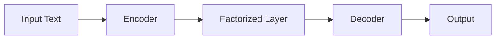
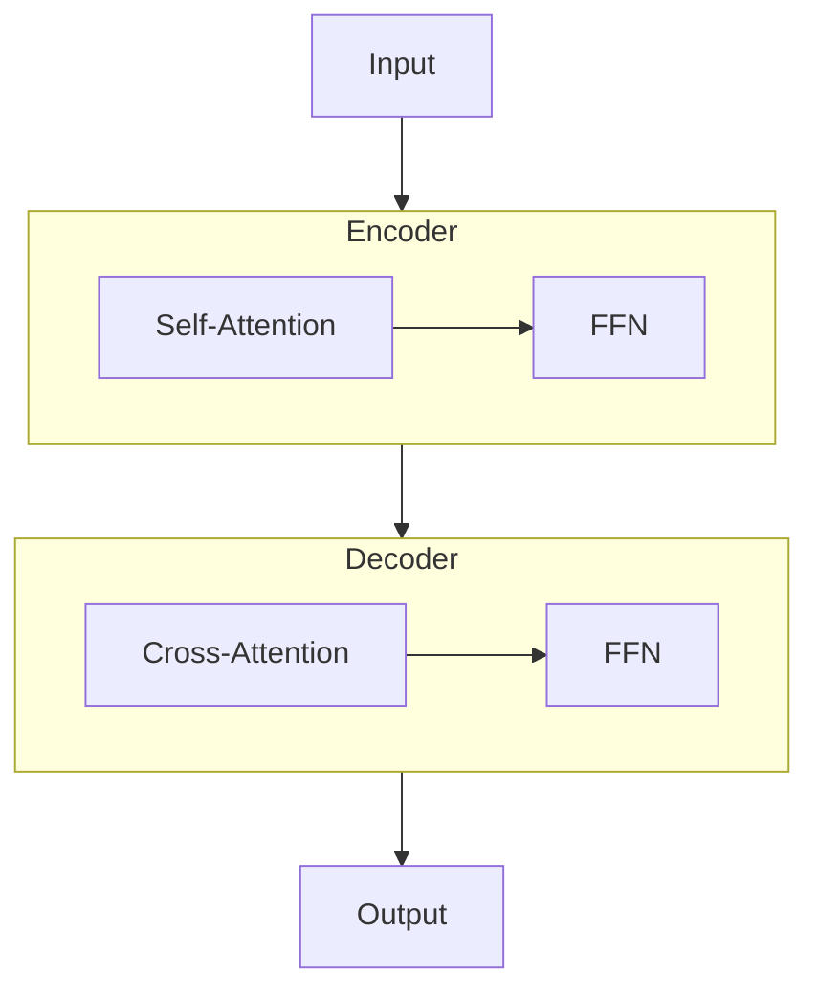
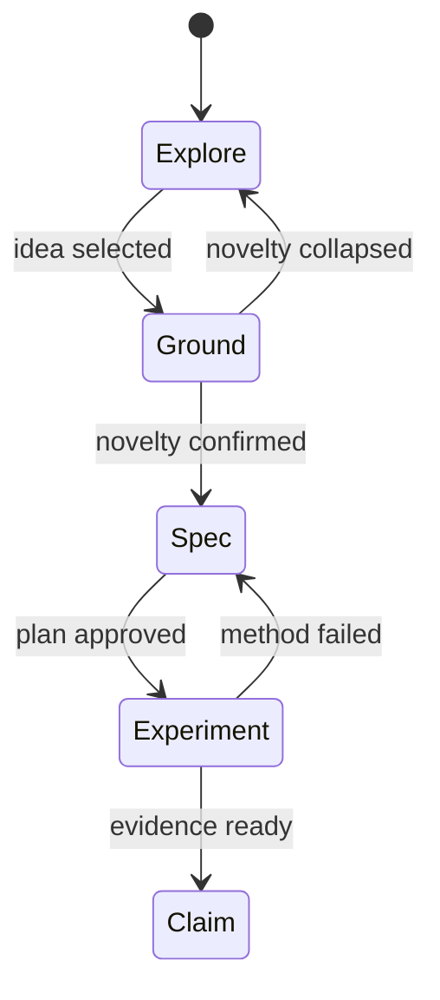
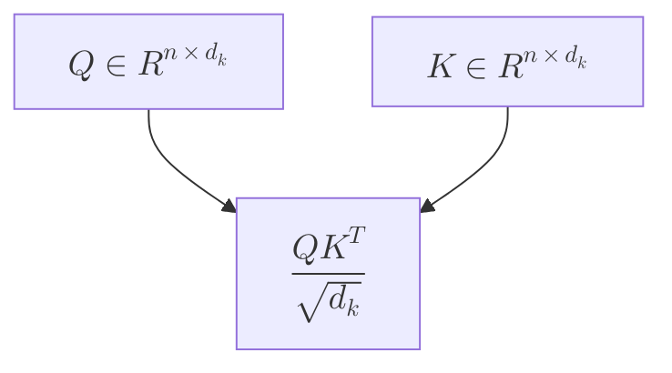
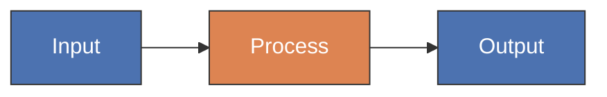

# Diagram Guide — Architecture, Pipeline, and Flow Diagrams

Non-data figures: model architecture, system pipelines, state machines, decision flows. These are NOT generated by matplotlib — they require different tools.

## Tool Selection

| Diagram Type | Recommended Tool | Strength | Limitation |
|-------------|-----------------|----------|------------|
| **Model architecture** | draw.io → export SVG/PDF | Most flexible, manual control | Not scriptable |
| **Pipeline / workflow** | Mermaid → render PNG/SVG | Quick, version-controllable, KaTeX math | Limited styling |
| **State machine** | Mermaid `stateDiagram-v2` | Clean, readable | Limited layout control |
| **Detailed architecture** | TikZ (LaTeX) | Publication-perfect, fully reproducible | Steep learning curve |
| **Quick sketch** | Synergy `diagram` tool | Inline in conversation | Not for final paper |

## Mermaid Workflow

Mermaid is the best balance of speed and quality for pipeline/flow/state diagrams.

### Setup
```bash
# Install if needed
npm install -g @mermaid-js/mermaid-cli

# Render
mmdc -i diagram.mmd -o diagram.png -b transparent -w 2000
mmdc -i diagram.mmd -o diagram.svg -b transparent
```

### Common diagram types

**Pipeline (left-to-right)**:


**Architecture with subgraphs**:


**State machine**:


### Mermaid with math (KaTeX)


### Mermaid styling


## draw.io Workflow

Best for complex architecture diagrams that need precise positioning.

### Setup
- Online: https://app.diagrams.net
- Desktop: https://github.com/jgraph/drawio-desktop
- VS Code extension: `hediet.vscode-drawio`

### Export settings for paper
- Format: SVG (vector, editable) or PDF (direct LaTeX inclusion)
- Background: transparent
- Border: 0
- Scale: 100%
- Include a copy of diagrams: check

### Style guidelines for academic diagrams
- **Color**: Use the same palette as your data figures (from the chosen theme)
- **Fonts**: Match paper body (serif or sans-serif, consistent)
- **Arrows**: 4-6px stroke, dark gray or black, clear arrowheads, labeled
- **Modules**: Rounded rectangles (8-12px radius), subtle fill, thin border
- **Grouping**: Light background rectangles for logical groups
- **Flow**: Left-to-right for pipelines, top-to-bottom for hierarchies

### What to avoid
- Rainbow color schemes
- Heavy drop shadows or 3D effects
- Thin hairline arrows (invisible at print size)
- Unlabeled connections
- Clip art or cartoon icons

## TikZ Workflow

For maximum precision and reproducibility. The figure is literally code in your paper.

### Basic architecture
```latex
\begin{tikzpicture}[
    block/.style={rectangle, rounded corners, draw, fill=blue!10, minimum width=2cm, minimum height=0.8cm},
    arrow/.style={-stealth, thick}
]
\node[block] (enc) at (0,0) {Encoder};
\node[block] (fac) at (3,0) {Factorized};
\node[block] (dec) at (6,0) {Decoder};
\draw[arrow] (enc) -- (fac);
\draw[arrow] (fac) -- (dec);
\end{tikzpicture}
```

### When to use TikZ vs draw.io
- **TikZ**: When the diagram must be pixel-perfect in LaTeX, when math labels are heavy, when reproducibility from source matters
- **draw.io**: When speed matters, when the diagram is complex with many components, when non-LaTeX-experts need to edit

## Integration with research_exhibit

Architecture/flow diagrams are also exhibit objects:

```
research_exhibit(action="create", title="Model Architecture", kind="figure", label="fig:arch")
research_exhibit(action="bind_sources", id="exh_XXX", script="figures/gen_arch.mmd")
research_exhibit(action="render", id="exh_XXX", output_path="paper/figures/arch.pdf")
```

For draw.io diagrams, the "script" is the `.drawio` source file.

## Multi-Panel Figures with Mixed Types

When a figure combines data plots + architecture diagrams:

1. Generate each panel separately (matplotlib for data, draw.io/Mermaid for diagrams)
2. Combine panels using LaTeX `\subfigure` or `\begin{minipage}`
3. Register the composite as a single exhibit
